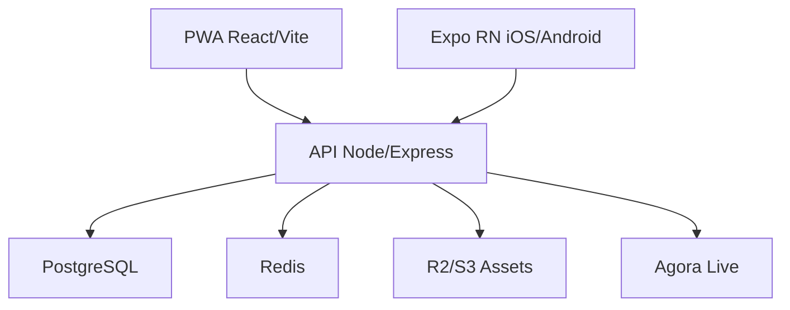

# Architecture AfriWonder

## Vue d'ensemble

AfriWonder est une super-app vidéo africaine construite avec une PWA React/Vite, une application mobile **Expo (React Native)** dans `frontend/` et un backend Node.js/Express/Prisma.

## Cible canonique (audit)

- Mobile de référence: `frontend/` (Expo React Native iOS/Android).
- Backend de référence: `backend/` (Node.js/Express/Prisma).
- Source de vérité API: `GET /api/openapi.json` et `GET /api-docs`.
- Les dossiers historiques/expérimentaux (ex: `mobile/`, `mobile-afriwonder/`, `flutter_app/`) ne définissent pas la cible de livraison actuelle.

## Diagramme cible



## Stack Technique

### Frontend
- **React 18** - Bibliothèque UI
- **Vite** - Build tool et dev server
- **React Router** - Routing
- **TanStack Query** - Gestion d'état serveur
- **Tailwind CSS** - Styling
- **Radix UI** - Composants accessibles
- **Framer Motion** - Animations

### Backend
- **Express** - API REST
- **Prisma** - ORM et base PostgreSQL
- **Functions TypeScript** - Logique métier (functions/)
- **Primary backend**: `backend/` (Node.js)

### Mobile
- **Expo / React Native** (`frontend/`) — client mobile iOS/Android (même dépôt que l’app Expo ; `npm run start` dans ce dossier)

## Structure du Projet

```
src/
├── api/              # Clients API
├── components/       # Composants React réutilisables
│   ├── ui/          # Composants UI de base (shadcn)
│   ├── common/      # Composants communs
│   ├── video/       # Composants vidéo
│   └── ...
├── pages/           # Pages de l'application
├── lib/             # Utilitaires et helpers
│   ├── logger.js    # Service de logging centralisé
│   ├── validators.js # Schémas de validation Zod
│   └── ...
├── hooks/           # Hooks React personnalisés
└── utils/           # Fonctions utilitaires

functions/           # Backend functions (TypeScript)
├── authentication.ts
├── payments.ts
├── videoEncoding.ts
└── ...

frontend/            # Application Expo (React Native) iOS/Android + scripts npm (start, android, ios)
├── app/
├── src/
├── app.json
└── package.json
```

## Flux de Données

1. **Authentification** : `AuthContext` gère l'état d'authentification
2. **Requêtes API** : TanStack Query pour le cache et la synchronisation
3. **État Local** : React hooks (useState, useReducer)
4. **Temps Réel** : WebSockets pour les notifications et chat

## Sécurité

- Authentification JWT (backend Express)
- RBAC (Role-Based Access Control)
- Validation des entrées avec Zod
- Chiffrement des données sensibles
- Rate limiting sur les APIs

## Performance

- Code splitting automatique avec Vite
- Lazy loading des routes
- Cache avec React Query
- Optimisation pour connexions lentes
- Mode offline avec Service Workers

## Logging

Le système de logging centralisé (`src/lib/logger.js`) remplace tous les `console.log/error/warn` :
- Structure des logs avec contexte
- Intégration Sentry en production
- Logs conditionnels selon l'environnement

## Tests

- **Vitest** - Framework de test
- **Testing Library** - Tests de composants React
- **Coverage** - Couverture de code avec v8

## Déploiement

- Build avec Vite : `npm run build`
- Preview : `npm run preview`
- CI/CD via GitHub Actions

