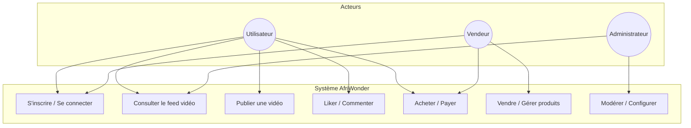
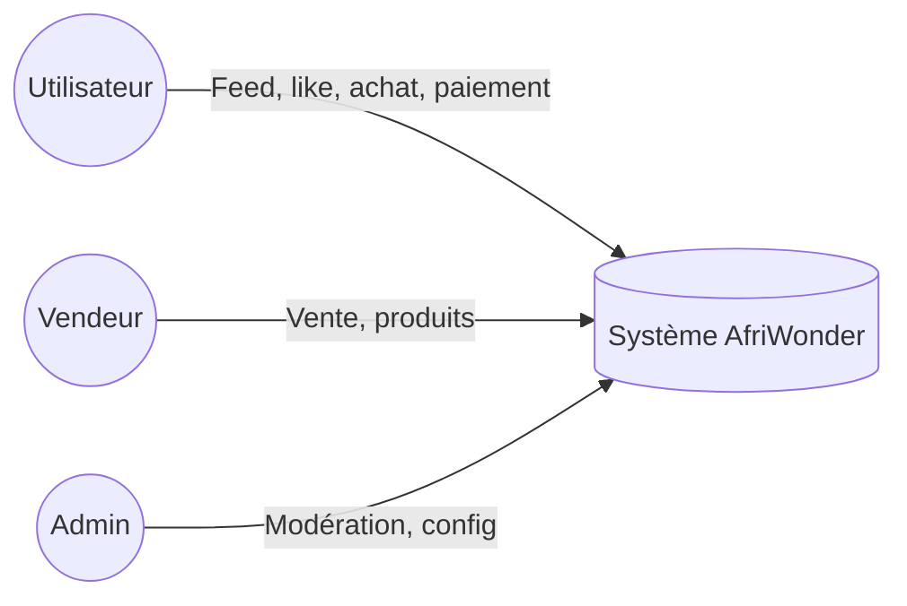
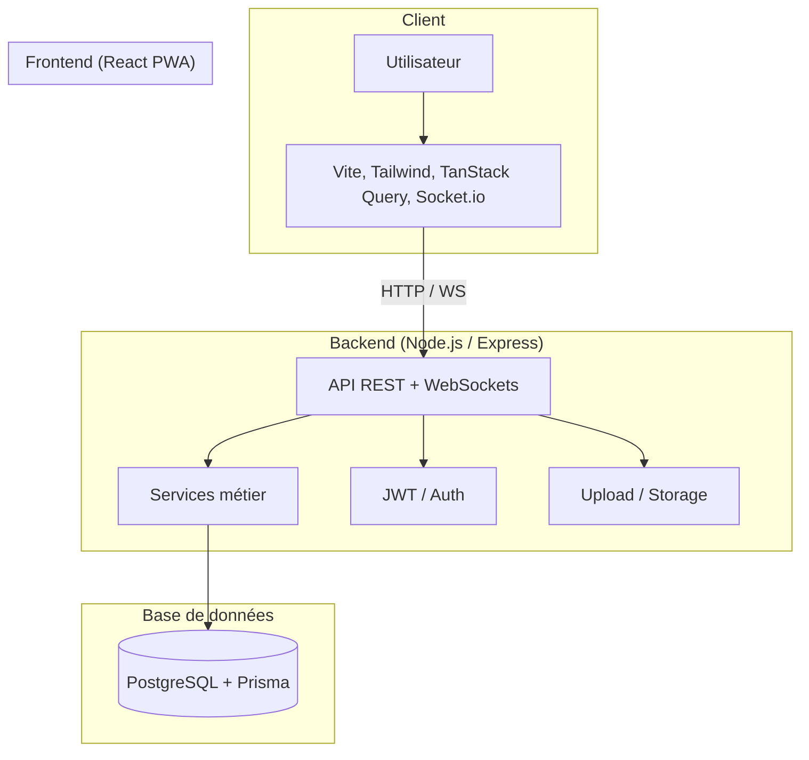
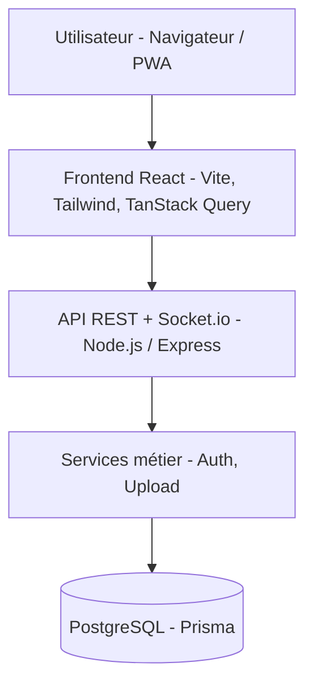
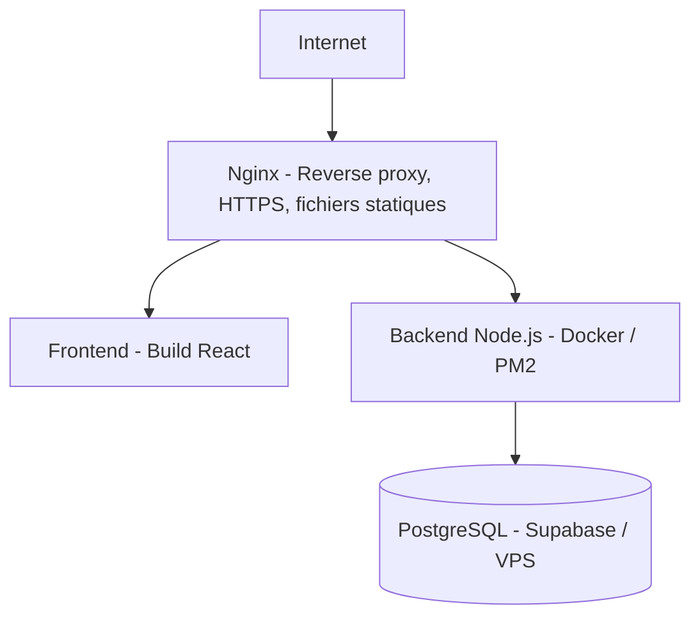
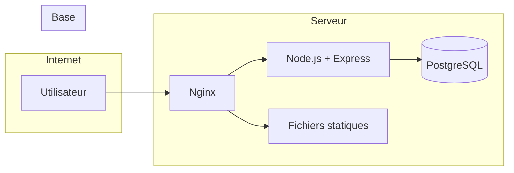
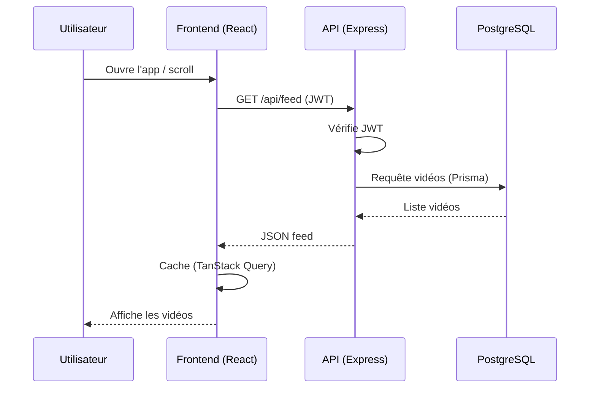
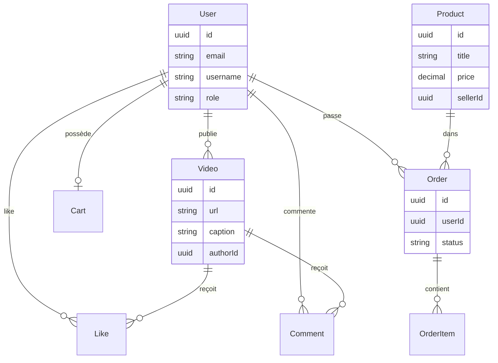
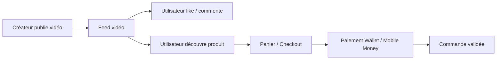

# Diagrammes AfriWonder — Rapport et soutenance

Ce fichier contient les diagrammes au format **Mermaid**. Tu peux :
- **Copier chaque bloc** dans [Mermaid Live Editor](https://mermaid.live) pour générer une image PNG/SVG.
- Les **insérer dans Word** (Export PNG) ou dans **PowerPoint** (slides 9 et 10 de la soutenance).
- Certains outils (VS Code avec extension Mermaid, GitHub, Notion) affichent les diagrammes directement dans le Markdown.

---

## 1. Diagramme de cas d’utilisation (UML-style)

Acteurs : Utilisateur, Vendeur, Administrateur. Cas d’usage : s’inscrire, se connecter, consulter le feed, publier une vidéo, liker/commenter, acheter, payer, vendre, modérer.



**Variante simplifiée (acteurs → système) :**



---

## 2. Diagramme d’architecture (couches)

Montre le flux : Utilisateur → Frontend → API → Services → Base de données.



**Version verticale (pour slide) :**



---

## 3. Schéma de déploiement (production)

Nginx, backend (Docker/PM2), PostgreSQL, frontend statique.



**Avec détails :**



---

## 4. Diagramme de séquence — Exemple : lecture du feed

Montre l’interaction entre le client, le frontend, l’API et la base lors du chargement du feed.



---

## 5. Modèle de données (simplifié) — Entités principales

Quelques entités clés du schéma Prisma (pour schéma conceptuel en soutenance).



---

## 6. Flux métier — De la création de contenu à l’achat

Résumé du parcours : création → feed → like → achat → paiement.



---

## Export des diagrammes en image

1. Ouvre [https://mermaid.live](https://mermaid.live).
2. Colle le code du bloc ` ```mermaid ... ``` ` (sans les balises).
3. Clique sur **Actions** → **Export** → **PNG** ou **SVG**.
4. Insère l’image dans ton rapport Word ou dans les slides 9 et 10 du PowerPoint.

Tu peux aussi utiliser l’extension **Mermaid** dans VS Code pour prévisualiser et exporter depuis l’éditeur.
