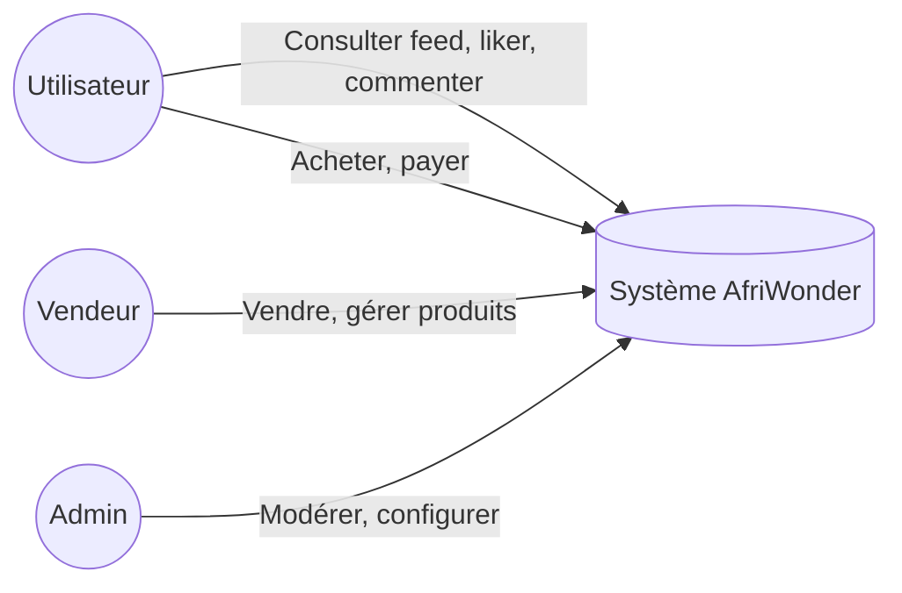

# Rapport de stage — AfriWonder  
**Projet de fin d’études / Stage projet**  
École d’ingénieurs — Khouribga

---

<!-- ========== PAGE DE GARDE (à copier en première page dans Word / Google Docs) ========== -->

# Page de garde

**École d’ingénieurs de Khouribga**  
**Filière :** [Préciser : Génie informatique / Systèmes d’information / etc.]  
**Année universitaire :** 2025-2026

---

**Rapport de stage – Projet de fin d’études**

# Conception et développement d’une super-app africaine : AfriWonder

**Présenté par :** [Ton nom, ex. Abdoulaye FANE]  
**Encadrant académique :** [Nom de l’encadrant]  
**Date :** [Mois Année, ex. Mars 2026]

---

<!-- ========== REMERCIEMENTS ========== -->

# Remerciements

Je tiens à remercier l’ensemble des enseignants de l’École d’ingénieurs de Khouribga pour la qualité de la formation reçue.

Je remercie également mon encadrant académique pour son accompagnement et ses conseils durant la réalisation de ce projet.

[Tu peux ajouter une phrase pour des camarades, la famille, ou des contributeurs du projet si pertinent.]

---

<!-- ========== RÉSUMÉ ========== -->

# Résumé

Ce rapport présente la conception et le développement d’**AfriWonder**, une plateforme numérique africaine conçue comme une super-application intégrant réseau social vidéo, marketplace, services et solutions de paiement. L’objectif du projet est de proposer une alternative locale aux grandes plateformes internationales (Facebook, TikTok, WhatsApp) tout en facilitant la création de contenu, les échanges et le commerce numérique en Afrique. Le projet a été réalisé en utilisant une architecture full-stack moderne : React et Vite pour le frontend, Node.js et Express pour l’API REST, Prisma et PostgreSQL pour la persistance des données. Une attention particulière a été portée à l’expérience utilisateur sur connexions lentes (buffer vidéo, PWA) et à la maintenabilité (tests, lint, documentation). Ce document décrit le contexte, les choix techniques, l’architecture, les travaux réalisés ainsi que les difficultés rencontrées et les perspectives d’évolution.

**Mots-clés :** super-app, Afrique, React, Node.js, PostgreSQL, PWA, marketplace, vidéo sociale.

---

<!-- ========== TABLE DES MATIÈRES (à régénérer dans Word avec "Insertion > Table des matières") ========== -->

# Table des matières

1. Contexte et cadre du stage  
   1.1 Présentation  
   1.2 Problématique et motivation  
   1.3 Objectifs du projet  

2. Description du projet  
   2.1 Vision  
   2.2 Fonctionnalités principales (modules)  
   2.3 Analyse du marché africain  

3. Méthodologie  

4. Technologies utilisées  
   4.1 Stack technique  
   4.2 Justification des choix  
   4.3 Architecture du projet (monorepo)  
   4.4 Base de données  
   4.5 Diagrammes  

5. Résultats et aboutissements  

6. Difficultés et solutions  

7. Modèle économique (vision)  

8. Déploiement et mise en production  

9. Conclusion  

10. Références  

Annexe A – Questions types du jury et pistes de réponses  
Annexe B – Pistes pour atteindre 40–60 pages  

---

# 1. Contexte et cadre du stage

### 1.1 Présentation
- **Type** : Stage réalisé sous forme de **projet** (hors entreprise).
- **Projet** : **AfriWonder** — plateforme type super-app pour le marché africain.
- **Établissement** : École d’ingénieurs de Khouribga.
- **Objectif** : Conception et développement d’une application web/mobile complète, de l’architecture à la mise en œuvre des fonctionnalités.

### 1.2 Problématique et motivation

Nous sommes partis d’une réflexion simple : aujourd’hui, la majorité des Africains utilisent des plateformes étrangères comme Facebook, TikTok, YouTube ou WhatsApp pour communiquer, partager du contenu et développer leurs activités. Mais si un jour ces plateformes deviennent inaccessibles pour nous, il n’existe pratiquement aucune grande plateforme créée par des Africains pour les Africains.

C’est dans cet esprit que nous travaillons sur une plateforme numérique africaine, une application tout-en-un destinée à valoriser les créateurs, faciliter la communication et soutenir l’économie numérique locale. **AfriWonder** vise à incarner cette alternative : une super-app où communiquer, créer du contenu, vendre, acheter et payer **sans quitter l’application**.

### 1.3 Objectifs du projet

- **Objectif général :** Concevoir et développer une super-application numérique africaine (AfriWonder) intégrant réseau social vidéo, marketplace, services et paiement, afin de proposer une alternative locale aux plateformes internationales.
- **Objectifs spécifiques :**
  - Définir l’architecture technique (frontend, backend, base de données) et les choix technologiques adaptés au contexte (connexions parfois lentes, usage mobile).
  - Implémenter un feed vidéo type TikTok (upload, likes, commentaires) avec une bonne expérience utilisateur sur connexions instables.
  - Intégrer les modules métier : marketplace, wallet, services (transport, food, etc.), et pages dédiées (Voyage, Cloud, Assistant).
  - Assurer la maintenabilité du projet (tests, documentation, conventions de code) et préparer une mise en production (déploiement, sécurité).

---

# 2. Description du projet

### 2.1 Vision
**AfriWonder** est présentée comme **la première super-app vidéo africaine**, reliant :
- **Créateurs** (vidéo, live, stories),
- **Commerçants** (marketplace, paiements mobiles),
- **Communauté** (réseau social, messagerie, services).

### 2.2 Fonctionnalités principales (modules)

| Module | Description |
|--------|-------------|
| **Vidéo** | Feed type TikTok, upload, likes, commentaires, playlists, défis |
| **Live** | Streaming avec dons, cadeaux, abonnements créateurs |
| **Marketplace** | Produits, panier, checkout, vendeurs, paiements (Orange Money, Wave, MTN, Stripe) |
| **Services** | Réservation, prestataires, disponibilités |
| **Transport** | Courses, chauffeurs |
| **Food** | Restaurants, menus, livraison |
| **Télémedecine** | Rendez-vous, pharmacie |
| **Immobilier** | Annonces, propriétés |
| **Billettrie** | Événements, billets |
| **Finance** | Wallet, microcrédit, crowdfunding |
| **Contenu** | Actualités, formations, emplois, civic (pétitions) |
| **Gamification** | Badges, points, classements |

Des pages dédiées ont été développées pour **Voyage**, **Cloud** et **Assistant** (IA), en plus des modules listés ci-dessus.

### 2.3 Analyse du marché africain

Le paysage numérique africain est aujourd’hui dominé par des plateformes étrangères. Le tableau suivant résume les acteurs principaux et leurs limites pour les utilisateurs africains ; il justifie la pertinence d’une plateforme locale comme AfriWonder.

| Plateforme | Origine | Usage principal | Limite pour l’Afrique |
|------------|---------|-----------------|------------------------|
| **TikTok** | Chine | Vidéo courte, créateurs | Pas de paiement local intégré ; monétisation limitée pour les créateurs africains. |
| **Facebook** | USA | Réseau social, groupes, marketplace | Algorithme opaque ; données hébergées hors continent ; peu de focus sur le commerce local. |
| **YouTube** | USA | Vidéo longue, tutoriels | Peu adapté aux micro-créateurs africains ; monétisation exigeante. |
| **WhatsApp** | USA (Meta) | Messagerie, groupes | Pas de discovery de contenu ni de marketplace native ; dépendance à un acteur unique. |

**Opportunité pour AfriWonder :** proposer une plateforme **créée par des Africains pour les Africains**, intégrant dès le départ vidéo sociale, marketplace, paiements mobiles (Orange Money, Wave, MTN) et services, avec les données et la valeur économique ancrées localement.

---

# 3. Méthodologie

La réalisation du projet AfriWonder a suivi une approche **itérative et structurée** :

- **Analyse et conception :** définition de la vision produit (super-app), identification des modules (vidéo, marketplace, services, finance), analyse du marché et des limites des plateformes existantes. Conception de l’architecture technique (couches frontend / API / base de données) et choix des technologies en fonction des contraintes (mobile, connexions lentes, maintenabilité).
- **Développement :** développement en **monorepo** (frontend à la racine, backend dans `backend/`), avec priorité au feed vidéo et à l’UX (buffer, cache, PWA), puis extension aux autres modules (marketplace, Voyage, Cloud, Assistant). Utilisation de **branches** et de **commits** structurés (feat, fix, docs) pour garder un historique clair.
- **Qualité et intégration :** tests unitaires (Vitest, Jest), tests E2E (Playwright), lint (ESLint) et formatage (Prettier) ; revue du code et documentation (README, docs d’architecture, diagrammes) pour faciliter la reprise et la soutenance.
- **Préparation à la production :** documentation du déploiement (Docker, Nginx, variables d’environnement), sécurisation (JWT, validation des entrées) et stratégie de déploiement (frontend statique, API, base PostgreSQL).

Cette méthodologie permet d’avancer par **objectifs concrets** (feed fonctionnel, marketplace, paiements) tout en maintenant une base de code et une documentation adaptées à un rapport de stage et à une évolution future.

---

# 4. Technologies utilisées

### 4.1 Stack technique

**Frontend**
- **React 18** + **Vite 6** (build et dev server)
- **React Router** v6 (routing)
- **TanStack Query** (cache, synchronisation API)
- **Tailwind CSS** + **Radix UI** (UI accessible)
- **Framer Motion** (animations)
- **Socket.io-client** (temps réel)
- **PWA** (Progressive Web App) pour usage mobile

**Backend**
- **Node.js 20+** + **Express**
- **Prisma** (ORM)
- **PostgreSQL** (base de données)
- **Socket.io** (WebSockets)
- **JWT** (authentification)

**Outils**
- **Vitest** (tests frontend), **Jest** (tests backend), **Playwright** (E2E)
- **ESLint** + **Prettier** (qualité de code)

### 4.2 Justification des choix

#### Frontend

| Technologie | Rôle | Justification du choix |
|-------------|------|------------------------|
| **React 18** | Interface utilisateur | Écosystème mature, composants réutilisables, grande communauté et ressources ; adapté à une application riche (feed, marketplace, nombreuses pages). |
| **Vite 6** | Build et serveur de dev | Démarrage et rechargement à chaud très rapides (ESM natif) ; meilleure productivité qu’avec Webpack pour un projet React moderne. |
| **React Router v6** | Navigation | Standard pour le routing côté client en React ; prise en charge des routes imbriquées et des gardes (auth). |
| **TanStack Query** | Données serveur | Cache des requêtes API, synchronisation, retry et invalidation ; évite les rechargements inutiles du feed et améliore l’UX sur connexions instables. |
| **Tailwind CSS** | Styles | Développement rapide, styles cohérents, bundle optimisé (purge du CSS inutilisé) ; adapté à une UI dense et responsive. |
| **Radix UI** | Composants | Composants accessibles (a11y), non stylés par défaut ; permet de garder Tailwind tout en respectant les standards d’accessibilité. |
| **Framer Motion** | Animations | Animations fluides et déclaratives ; utile pour le feed type TikTok, transitions de pages et retours visuels. |
| **Socket.io-client** | Temps réel | Notifications, chat, live : communication bidirectionnelle sans polling ; même stack que le backend (Node.js) pour une intégration simple. |
| **PWA** | Usage mobile | Installation sur téléphone sans store, mode hors-ligne partiel, notifications ; important pour l’Afrique où le web mobile et les connexions intermittentes sont courants. |

#### Backend

| Technologie | Rôle | Justification du choix |
|-------------|------|------------------------|
| **Node.js + Express** | API REST et serveur | Un seul langage (JavaScript/TypeScript) partagé avec le frontend ; Express léger, flexible et adapté à une API avec de nombreuses routes (auth, feed, upload, paiements, etc.). |
| **Prisma** | ORM | Schéma déclaratif, migrations versionnées, typage fort ; réduit les erreurs SQL et accélère l’évolution du modèle de données (utilisateurs, vidéos, commandes, live, etc.). |
| **PostgreSQL** | Base de données | Base relationnelle fiable, ACID, adaptée aux données structurées (utilisateurs, produits, commandes, transactions) ; support JSON pour champs flexibles si besoin. |
| **Socket.io** | WebSockets | Même protocole que le client ; notifications en temps réel, présence, chat et événements live sans multiplier les technologies. |
| **JWT** | Authentification | Tokens stateless : pas de session côté serveur, adapté aux API REST et au scale ; refresh token pour renouveler l’accès en sécurité. |

#### Outils

| Technologie | Rôle | Justification du choix |
|-------------|------|------------------------|
| **Vitest / Jest** | Tests unitaires | Vitest rapide et compatible Vite côté frontend ; Jest côté backend ; couverture des services et de la logique critique. |
| **Playwright** | Tests E2E | Tests navigateur réalistes (connexion, feed, checkout) ; détection des régressions avant déploiement. |
| **ESLint + Prettier** | Qualité de code | Règles de style et bonnes pratiques homogènes ; utile en travail d’équipe et pour maintenir un gros codebase. |

En résumé : les choix visent **productivité** (React, Vite, Prisma), **UX et résilience** (TanStack Query, PWA, buffer vidéo), **cohérence full-stack** (JavaScript/TypeScript partout, Socket.io partagé) et **maintenabilité** (tests, lint, migrations).

### 4.3 Architecture du projet (monorepo)

```
AfriWonder/
├── src/                    # Frontend React
│   ├── api/                 # Clients API
│   ├── components/          # Composants (ui, video, marketplace, etc.)
│   ├── pages/               # Pages / écrans (100+ routes)
│   ├── hooks/               # Hooks React
│   ├── lib/                 # Utilitaires, AuthContext
│   └── ...
├── backend/                 # Backend Express
│   ├── prisma/              # Schéma DB, migrations
│   └── src/
│       ├── routes/          # Routes API
│       ├── services/        # Logique métier
│       ├── middleware/      # Auth, rate limit
│       └── ...
└── docs/                    # Documentation
```

### 4.4 Base de données
- Modèle de données riche (utilisateurs, vidéos, produits, commandes, live, événements, formations, emplois, civic, etc.) géré avec **Prisma** et **PostgreSQL**.
- Migrations versionnées pour l’évolution du schéma.

### 4.5 Diagrammes

#### Diagramme de cas d’utilisation (simplifié)

Les acteurs principaux sont l’**utilisateur** (créateur ou consommateur), le **vendeur** et l’**administrateur**. Cas d’usage : s’inscrire / se connecter, consulter le feed vidéo, publier une vidéo, liker / commenter, acheter sur la marketplace, payer (wallet / mobile money), utiliser les services (transport, food, etc.), gérer son profil.



*En soutenance : tu peux présenter un vrai diagramme UML « cas d’utilisation » (acteurs + ovales) dessiné avec Draw.io, Lucidchart ou PlantUML à partir de cette liste.*

#### Diagramme d’architecture (couches)

```
                    +------------------+
                    |   Utilisateur    |
                    | (navigateur/PWA) |
                    +--------+---------+
                             |
                             v
                    +------------------+
                    | Frontend (React) |
                    |  Vite, Tailwind  |
                    |  TanStack Query  |
                    +--------+---------+
                             |
                    HTTP/WS  |
                             v
                    +------------------+
                    |  API REST + WS   |
                    | Node.js / Express|
                    |  Socket.io, JWT  |
                    +--------+---------+
                             |
                    +--------+--------+
                    |        |        |
                    v        v        v
              +----------+ +------+ +----------+
              | Services | |Auth  | | Upload   |
              | métier   | |JWT   | | Storage  |
              +-----+----+ +------+ +----------+
                    |
                    v
              +------------------+
              |   PostgreSQL     |
              |   (Prisma ORM)   |
              +------------------+
```

En résumé : **Utilisateur → Frontend (React PWA) → API REST (Node.js/Express) → Services métier → Base de données (PostgreSQL)**. Le temps réel (notifications, chat, live) passe par **WebSockets (Socket.io)** sur le même serveur.

#### Schéma de déploiement (cible production)

```
  [Internet]
       |
       v
  +---------+     +------------------+
  | Nginx   | --> | Backend (Node.js) |
  | (reverse|     | PM2 / Docker      |
  |  proxy) |     +--------+----------+
  +----+----+              |
       |                   v
       |            +--------------+
       +----------> |  PostgreSQL  |
       |            | (Supabase/VPS)|
       v            +--------------+
  +------------+
  | Frontend   |
  | (fichiers  |
  |  statiques)|
  +------------+
```

*En production : Nginx sert le frontend (build React) et reverse-proxy vers l’API ; le backend peut tourner en Docker ou avec PM2 ; la base peut être PostgreSQL sur Supabase ou un VPS.*

---

# 5. Résultats et aboutissements

## 5.1 Travaux réalisés

Tu peux détailler ici **ce que tu as personnellement fait** pendant le stage, par exemple :

- **Feed vidéo** : implémentation ou amélioration du défilement type TikTok, gestion du like/scroll/son, optimisation pour connexions lentes (buffer, preload).
- **Pages métier** : développement ou intégration de pages (Home, Create, Marketplace, Voyage, Cloud, Assistant, etc.).
- **API et backend** : création ou modification de routes (auth, feed, upload, proxy, travel, cloud, mapPlaces, ai), services associés.
- **UX / accessibilité** : flèche de retour systématique, messages « Connexion lente », comportement du player vidéo.
- **Qualité** : tests (unitaires, E2E), lint, conventions de commit (feat, fix, docs, etc.).
- **Documentation** : mise à jour du README, fiches d’architecture, design tokens, rapports (PWA, écarts CDC, etc.).

*À adapter selon ton vécu réel du projet.*

## 5.2 Aboutissements

- **Livrable fonctionnel :** application web (PWA) opérationnelle avec feed vidéo, marketplace, modules services, authentification, et pages dédiées (Voyage, Cloud, Assistant). L’utilisateur peut consulter du contenu, publier, liker, commenter, parcourir des produits et utiliser les parcours métier implémentés.
- **Livrable technique :** architecture full-stack documentée (React, Node.js, PostgreSQL), schéma de base de données (Prisma) avec migrations, API REST et WebSockets, documentation (README, architecture, diagrammes, guide déploiement).
- **Livrable projet :** rapport de stage structuré, plan de soutenance et diagrammes réutilisables pour la présentation orale.

---

# 6. Difficultés et solutions

- **Connexions lentes** : buffer minimum, préchargement adaptatif, message utilisateur « Connexion lente — chargement pour une lecture fluide… ».
- **Stabilité du player** : règles strictes sur la logique de lecture (pas de rechargement intempestif, premier like sans saut de vidéo, son au premier clic).
- **Cohérence UX** : flèche de retour sur toutes les pages secondaires, stratégie de cache du feed (pas de double chargement au premier affichage).
- **Complexité du monorepo** : séparation claire frontend/backend, scripts d’installation et de vérification (install-all, verify-cdc, etc.).

---

# 7. Modèle économique (vision)

- Publicité (type Facebook / TikTok)
- Commissions sur la marketplace (5–10 %)
- Dons et abonnements créateurs
- Commission sur les paiements numériques
- Services premium (comptes vérifiés, promotion de contenu)

---

# 8. Déploiement et mise en production

Pour une mise en production crédible, l’architecture peut s’appuyer sur les éléments suivants (déjà documentés ou prévus dans le projet) :

| Élément | Rôle | Exemple / outil |
|--------|------|-----------------|
| **Docker** | Conteneuriser le backend (et éventuellement le frontend servi par Nginx) pour des déploiements reproductibles. | `Dockerfile` pour Node.js, `docker-compose` avec PostgreSQL. |
| **Nginx** | Reverse proxy : servir les fichiers statiques (build React), rediriger `/api` vers le backend, gérer SSL (HTTPS). | Voir `docs/HTTPS_LETSENCRYPT_PRODUCTION.md`, `docs/WAF_CLOUDFLARE_SETUP.md`. |
| **Cloud / VPS** | Héberger l’application. | AWS, GCP, ou VPS (DigitalOcean, OVH, etc.) ; base PostgreSQL possible via **Supabase** (PostgreSQL managé). |
| **Variables d’environnement** | Secrets et config (DATABASE_URL, JWT_SECRET, clés API). | Fichiers `.env` en production sécurisés ; pas de secrets dans le code. |

Le projet contient déjà des documentations (par ex. `docs/DOCKER_DEPLOY.md`, `docs/GUIDE_PRODUCTION_COMPLET.md`) sur lesquelles s’appuyer pour détailler cette section dans la version longue du rapport.

---

# 9. Conclusion

- **Bilan :** Conception et développement d’une super-app complète (vidéo, marketplace, services, finance, contenu) avec une stack moderne (React, Vite, Express, Prisma, PostgreSQL) et une attention à l’UX (PWA, mobile, connexions lentes). Le projet AfriWonder démontre qu’il est possible de concevoir une plateforme numérique africaine tout-en-un, depuis l’architecture jusqu’aux fonctionnalités métier, en justifiant les choix techniques et en préparant le déploiement.
- **Compétences mobilisées :** développement full-stack, architecture logicielle, base de données, API REST, temps réel (WebSockets), tests, documentation.
- **Perspectives :** passage possible vers React Native (Expo) pour des applications natives, backend Golang pour la scalabilité, déploiement en production (Docker, Nginx, cloud), et partenariats avec les acteurs des paiements mobiles (Orange Money, Wave, MTN).

---

# 10. Références

- Dépôt du projet : AfriWonder (monorepo)
- Documentation interne : `docs/` (ARCHITECTURE.md, API.md, VISION_ET_ARCHITECTURE_CIBLE.md, DOCKER_DEPLOY.md, GUIDE_PRODUCTION_COMPLET.md, etc.)
- **Soutenance :** `docs/SOUTENANCE_AFRIWONDER_SLIDES.md` (plan des 15 slides).
- **Diagrammes :** `docs/DIAGRAMMES_AFRIWONDER.md` (Mermaid : cas d’utilisation, architecture, déploiement, séquence, modèle de données ; export PNG/SVG via [mermaid.live](https://mermaid.live)).
- README : vue d’ensemble, installation, lancement, dépannage

---

# Annexes

## Annexe A – Questions types du jury et pistes de réponses

| Question type | Piste de réponse |
|---------------|------------------|
| **Pourquoi React et pas Vue ou Angular ?** | Écosystème très riche, composants réutilisables, bonne adéquation avec une app à nombreuses pages ; équipe / communauté React ; Vite optimise le build. |
| **Pourquoi une PWA et pas une app native ?** | Une seule codebase web ; déploiement sans store ; mises à jour immédiates ; adapté aux connexions intermittentes (cache). L’évolution vers React Native (Expo) est prévue pour du natif si besoin. |
| **Comment gérez-vous la scalabilité ?** | API stateless (JWT), base PostgreSQL avec index et migrations, possibilité de cache Redis, CDN pour les médias ; architecture prête pour séparer services et base en production. |
| **Sécurité : comment protégez-vous les données ?** | JWT avec refresh token, mots de passe hashés, validation des entrées (Zod), CORS configuré ; en production : HTTPS, variables d’environnement pour les secrets. |
| **Pourquoi PostgreSQL et pas MongoDB ?** | Données fortement relationnelles (utilisateurs, commandes, produits, transactions) ; besoin de cohérence ACID ; Prisma permet d’évoluer le schéma proprement avec des migrations. |
| **Qu’est-ce que vous avez fait personnellement ?** | Répondre avec tes vrais travaux : ex. feed vidéo, buffer/connexions lentes, pages Voyage/Cloud/Assistant, routes API, tests, documentation. |

*À préparer en amont avec tes contributions réelles pour être précis à l’oral.*

## Annexe B – Pistes pour atteindre 40–60 pages

Pour transformer ce rapport en document de 40 à 60 pages attendu par le jury :

1. **Page de garde, remerciements, résumé, table des matières** : déjà inclus ; les faire figurer en début de document dans Word/Google Docs.
2. **Développer chaque section** : 2–4 pages par chapitre (Contexte, Projet, Marché, Stack, Architecture, Travaux, Difficultés, Déploiement, Conclusion) avec exemples concrets, captures d’écran de l’application.
3. **Diagrammes** : ajouter des diagrammes UML propres (cas d’utilisation, séquence, déploiement) générés avec Draw.io, Lucidchart ou PlantUML et les insérer en pleine page.
4. **Captures d’écran** : feed vidéo, marketplace, page de paiement, profil, etc., avec légendes.
5. **Extraits de code** : 1–2 extraits courts (ex. configuration Vite, route API, schéma Prisma) pour illustrer les choix techniques.
6. **Tableaux et listes** : garder les tableaux (marché, technologies, déploiement) ; éventuellement détailler la liste des routes API ou des modèles de données en annexe.
7. **Glossaire / références** : une page de définitions (PWA, JWT, ORM, etc.) et une liste de références (docs du projet, liens officiels React, Node, Prisma).

En exportant ce Markdown vers Word (ou Google Docs) et en suivant ces pistes, tu obtiens une base solide pour un rapport académique complet et crédible pour une école d’ingénieurs.

**Note sur la note (16–18/20) :** Un rapport qui montre une **architecture claire**, des **choix techniques justifiés**, une **réflexion produit et marché**, et une **vision déploiement/scalabilité** est tout à fait en mesure de viser une très bonne note. Les jurys valorisent la cohérence du raisonnement, la maîtrise des concepts (full-stack, API, base de données, UX) et la capacité à expliquer *pourquoi* (PWA, React, PostgreSQL, buffer vidéo). Bien préparer la section « Travaux réalisés » et les questions de l’Annexe A renforce encore la crédibilité à l’oral.

---

*Document préparé pour la soutenance du rapport de stage — École d’ingénieurs de Khouribga. À personnaliser avec tes contributions précises, ton nom, l’encadrant et les dates de stage.*
