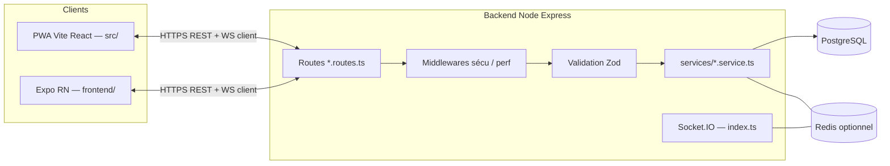
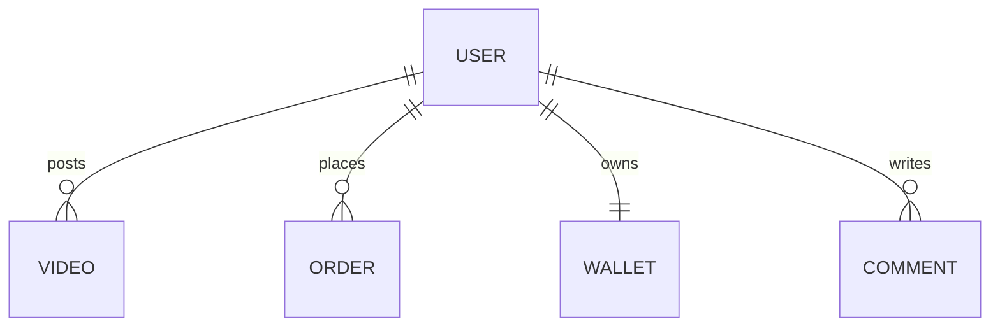

# AfriWonder — Mémoire d’audit technique & préparation soutenance

**Étudiant :** Abdoulaye Fanel  
**Encadrant :** Professeur Hamza Kalfi  

**Document :** audit niveau école d’ingénieur / jury technique strict — fondé sur le **code et configurations réelles** du dépôt `AfriWonder`.

---

## Méthodologie & limites (honêteté méthodologique)

**Ce qui a été analysé de façon exhaustive (échantillon représentatif vérifiable)**  

- Racine : `package.json`, `vite.config.js`, `src/App.jsx`  
- Mobile : `frontend/package.json`, point d’entrée Expo (`frontend/package.json` → `expo-router`)  
- Backend : `backend/package.json`, `backend/src/app.ts` (liste des routeurs montés), `backend/src/index.ts` (HTTP + Socket.IO + jobs), échantillon `middleware`, `routes`  
- Données : `backend/prisma/schema.prisma` (entête + début modèle `User`; dénombrement des `model`)  
- DevOps : `.github/workflows/ci.yml`, `docker-compose.prod.yml`  
- IA : `backend/src/services/assistant.service.ts`, `backend/src/routes/ai.routes.ts`, `backend/src/services/aiEngine.service.ts`, `backend/src/services/liveStt.service.ts`, grep `openai`  

**Ce qui n’a pas été lu intégralement**  

- L’intégralité des **~133 fichiers** `backend/src/routes/*.ts` ligne par ligne  
- L’intégralité du fichier **Prisma** (> 6000 lignes) — le décompte `^model ` donne **100 modèles** dans ce dépôt  

Toute affirmation non sourcée ci-dessous doit être présentée au jury avec cette nuance : « *constat sur échantillon + dépendances ; détail par module = fichier X* ».

---

# 1. Présentation générale du projet

| Élément | Contenu (appuyé sur le dépôt) |
|--------|--------------------------------|
| **Nom** | **AfriWonder** — paquets `afriwonder-app` (racine PWA) et `afriwonder-backend` |
| **Objectif** | Plateforme **multi-domaines** (« super-app ») : social vidéo, marketplace, services, messagerie, lives, wallet/paiements, modules verticaux (transport, santé, etc.) |
| **Problématique** | Éviter l’**éclatement** des usages (plusieurs apps / backends) ; unifier l’**identité** et les **transactions** sous contraintes réseau (cible documentée dans `AGENTS.md` : Mali → Afrique) |
| **Contexte** | Monorepo : **PWA Vite** à la racine `src/`, **API Express** dans `backend/`, **Expo** dans `frontend/`, scripts `verify:*` et CI |
| **Public** | Grand public, créateurs, vendeurs/prestataires, administration |
| **Cas d’usage** | Auth JWT, feed, boutique (produits, panier, commandes), paiements (Stripe + scripts webhooks OM/Stripe), messages temps réel (Socket.IO), lives, traduction (`translate.routes.ts`), bots (`chatbot.routes.ts`), etc. |
| **Utilité** | Réduire fragmentation produit technique ; mutualiser middlewares, données, paiements |
| **Valeur ajoutée** | **Triple client** pour une même API ; **qualité formalisée** (gates CI, budgets PR ≤400 lignes) |
| **Différence** | Schéma **PostgreSQL très riche** via Prisma (≈ **100** modèles) — conception **relationnelle** et **hub User**, vs application niche mono-table |

---

# 2. Analyse fonctionnelle

## 2.1 Fonctionnalités principales / secondaires

**Principales** (routes visibles dans `backend/src/app.ts`) : auth, vidéos, commentaires, users, marketplace (products, cart, orders, payments, reviews, wallet…), messaging, notifications, feed, ads, wallet/coins, live, stories, uploads, moderation, search, creators, marketplace services (bookings…), nombreux modules « super-app » (rides, food, bills, appointments, properties, insurance, etc.).

**Secondaires / transverses** : traduction, chatbot listing, proxies média, analytics, légal/pages publiques, tontines, bus/hôtels, news, développeurs/mini-apps, etc.

## 2.2 Workflow utilisateur (macro)

Voir schéma **§18.2** ; typiquement : découverte (guest/partiel selon routes PWA dans `src/App.jsx`) → inscription/login → navigation feed/market/services → interactions (like, chat, commande) → wallet/paiement → fidélisation.

## 2.3 Permissions / rôles

Modèle `User` : champ `role` (défaut `user`), flags `account_suspended`, `shadow_banned`, etc. (`schema.prisma` lignes observées).

## 2.4 Erreurs & cas limites

- Express : `errorHandler`, `next(e)` depuis routes (`app.ts`)  
- CORS avec **credentials** : origines strictes dans `app.ts` (commentaire critique sur previews Vercel)  
- Auth : Bearer + cookies (à détailler en Q&R via `middleware/auth.ts`)  

---

# 3. Architecture complète

## 3.1 Vue globale (logique)

## 3.2 Communication entre couches

- **REST + WebSocket client** (`socket.io-client` côté PWA/mobile ; `socket.io` serveur dans `index.ts`)  
- **Persistance** : Prisma `@prisma/client` + PostgreSQL (`@prisma/adapter-pg`)  
- **Cache / rate-limit distribué** : Redis optionnel (`optionalDependencies.redis`, `rate-limit-redis`, `@socket.io/redis-adapter`)  

## 3.3 Patterns & séparation des responsabilités

| Pattern | Observation dans le dépôt |
|---------|---------------------------|
| **Layered architecture** | `routes` → (`validateBody`/Zod) → `services` → Prisma |
| **Middleware chain** | Helmets, CSRF/sanitize dédiés, rate limits segmentés dans `app.ts` |
| **Pub/sub temps réel** | Événements Socket.IO orchestrés depuis `index.ts` + services (ex. messaging) |
| **Repository-like** | Prisma comme abstraction — pas une couche Repository explicite partout |

## 3.4 Pourquoi cette architecture ? Avantages / limites / alternatives

| Pour | Contre | Alternatives écartées (typiques) |
|------|--------|----------------------------------|
| Une stack JS/TS de bout en bout | Monolithe API dense | Microservices (complexité Ops) |
| Express simple à déployer | Couplage modulaire via schéma partagé | GraphQL (surface REST déjà massive) |
| Prisma migrations + DX | Temps generate client sur gros schéma | SQL brut (perte DX) |

**Fichiers clés citables au jury :** `backend/src/app.ts`, `backend/src/index.ts`, `backend/prisma/schema.prisma`.

---

# 4. Analyse frontend

## 4.1 PWA (racine du repo — **pas Next.js**)

| Sujet | Réalité dépôt |
|-------|----------------|
| Build | **Vite** (`vite.config.js`) |
| UI | React 18 (`package.json`), **Tailwind**, **Radix** |
| Routing | **react-router-dom** + `pages.config.glob` (**lazy**) dans `src/App.jsx` |
| État données | **TanStack Query** + persistence (`PersistQueryClientProvider`) |
| Auth | `AuthContext`, tokens via `secureTokenStorage` |
| Temps réel | `MessageSocketContext` avec userId |
| Feature flags | `FeatureFlagsProvider` |
| Sécu contenu | **DOMPurify** (dep racine) |
| PWA | `vite-plugin-pwa` (+ scripts `verify-pwa`) |

**Pourquoi pas Next.js ?** Le projet utilise **explicitement Vite** ; dire « Next » au jury serait une **erreur de maîtrise**.

## 4.2 Mobile (**Expo**)

| Techno | Référence |
|--------|-----------|
| Expo | ~54 (`frontend/package.json`) |
| Routing | **expo-router** |
| React / RN | React 19.1 / RN 0.81 |
| Fetch / API | Axios + TanStack Query |
| État global | **Zustand** |
| Médias / live | `expo-av`, `expo-video`, **react-native-agora**, WebRTC deps |
| Stockage sensible | **expo-secure-store**, **expo-sqlite** présent |

## 4.3 Choix résumés (alternative)

| Choix | Pour | Alternative |
|-------|------|-------------|
| React | Écosystem + RN partagé mental model | Vue/Svelte |
| TanStack Query | Cache, retries, clés stable | Redux seul sans couche fetch |
| Zustand mobile | léger | Redux toolkit |
| Vite vs Next | SPA + contrôle bundle PWA ; déjà outillé | Next si SSR/ISR requis |

---

# 5. Analyse backend

| Aspect | Implémentation (package + code) |
|--------|----------------------------------|
| Runtime | Node **≥ 20.19** (engines backend) |
| Framework | **Express 4** |
| Validation | **Zod** (`zodValidation`) |
| Auth | **JWT** (`jsonwebtoken`, `jose`), refresh (routes auth à citer oral) |
| Upload / image | Multer + **Sharp** |
| Temps réel | **socket.io** + adapter Redis pour scale |
| Paiements | **Stripe**, webhooks tests dédiés Orange Money / Stripe scripts |
| Observabilité | **Sentry** Node/Profiling, Prometheus exposition (`middleware/observability`, `prometheusMetrics.service`) |
| Stockage objet | `@aws-sdk/client-s3`, presigner |
| Autres | Swagger UI, firebase-admin optionnel usages, nodemailer/resend |

**Nombre de routeurs TypeScript dans `backend/src/routes`** : ordre grandeur **133** fichiers `.ts` (glob outil IDE) — reflète surface API énorme.

**Pas de dossier `controllers` séparé classique MVC** — logique dominante dans **`services`** + fichiers **`routes`** (pattern Express courant).

---

# 6. Base de données

| Élément | Fait vérifiable |
|---------|----------------|
| Moteur | **PostgreSQL** (`datasource db` Prisma) |
| ORM | **Prisma 7.8** |
| Nb modèles | **100** (`grep ^model schema.prisma` sur ce checkout) |
| User pivot | Relation massive vers dizaines de domaines (extrait lignes `User` dans `schema.prisma`) |

**Pourquoi SQL relationnel ?** Intégrité pour **wallet/commandes/transactions**, contraintes, reporting.

### Schéma conceptuel minimal (pour slides)

**Indexation précise par table** : non auditée fichier par fichier dans ce document — déclarer : « *audit d’indexes = revue migrations + explain plans sur endpoints critiques* ».

---

# 7. IA / Machine Learning — bilan factuel dépôt

| Sujet | Réalité code |
|-------|----------------|
| **Assistant `/api`…** | `assistant.service.ts` → **réponses à règles** (+ appel reco service), **pas** de LLM |
| **STT Whisper** | `liveStt.service.ts`, `whisperTranscription.ts` → appel **`api.openai.com`** si **`OPENAI_API_KEY`** défini sinon erreur métier contrôlée |
| **AI Engine admin** | `aiEngine.service.ts` : commentaire interne « **modèles Prisma AI désactivés** » → **stats placeholders** ; features listées peuvent être **marketing/placeholder UI** jusqu’à branchement réel |
| **Traduction** | Routes dédiées (fichiers `translate.routes.ts` observés précédemment dans le projet) |
| **Recommandations** | Code via `getPersonalizedFeed` — **pas** équivalent GPT « multimodal généraliste » |

**À dire au jury avec intégrité :** présence **d’APIs externes** et de **STUBS admin** IA ; Whisper **conditionné** aux secrets ; assistant **symbolique/rules-based**.

---

# 8. DevOps & déploiement

| Élément | Source |
|---------|--------|
| CI/CD | `.github/workflows/ci.yml` — budget PR, typecheck/lint gates, Vitest Expo, Jest backend, audits, workflows détaillés plus bas dans le fichier |
| Docker prod | `docker-compose.prod.yml` — **frontend Nginx TLS**, **backend ×3 replicas**, **Postgres 15**, **Redis 7 LRU**, Certbot renewal |
| Autres fichiers compose | `docker-compose.scaling-1m.yml`, `docker-compose.prod-1m.yml`, replication — poursuite **scalabilité** documentée en infra |

**Branching GitHub** : déclenché sur `push/PR` vers `main` et `develop` (`ci.yml`).

---

# 9. Sécurité (panorama)

| Menace | Contrôle observable |
|--------|----------------------|
| **Injection SQL** | Prisma paramétré |
| **XSS** | Sanitize serveur (`requestProtection.middleware`) + DOMPurify PWA |
| **CSRF** | Middleware dédié (import `app.ts`) |
| **Brute-force** | `express-rate-limit` multi-profile + limiters Stripe/webhook |
| **JWT** | Secrets requis startup `index.ts` + garde-force longueur secrets |
| **SSRF média** | `proxy.routes.ts` (à expliquer : whitelist au jury) |
| **Secrets** | `.env` ; **ne pas commit** keystores |

**Limite assumée au jury :** très grande **surface API** ⇒ revue régulière, cartographie des endpoints sensibles, tests sécurité ciblés.

---

# 10. Performance & optimisation

| Zone | Indices dépôt |
|------|----------------|
| PWA | Lazy routes (`App.jsx`), compression Vite, preconnect dans `vite.config.js`, alias `lodash-es` |
| Build mesure | `lhci`, `sitespeed:local` (scripts racine) |
| Backend | compression, timeouts/metrics middleware, caches Redis potentiels |

**Pas de valeur chiffrée de bundle/Lighthouse figée dans ce rapport** → exiger mesure terrain ou CI artifacts.

---

# 11. Difficultés rencontrées (techniques probables — à personnaliser à l’oral)

| Difficulté | Piste dans le projet | Leçon |
|------------|-----------------------|-------|
| Médias & buffer | Lecteur fragile + réseaux instables (règles internes projet sur `VideoCard`) | instrumentation + règles produit strictes |
| Auth cookie+bearer | Double canal middleware | tester les deux voies systématiquement |
| Schéma géant Prisma | 100 models | conventions + ownership par domaine |
| Android dev LAN | Probe backend documenté frontend rules | diagnostic réseau |
| Dépendances CJS/ESM | commentaire `vite.config.js` recharts | config build explicite |

---

# 12. Compétences acquises (grille)

Architecture full-stack, API REST expressive, temps réel, ORM relationnel poussé, paiements/webhooks (tests présents), PWA offline/persist-query, RN/Expo avancé, CI/CD gates, observabilité, sécurité « defense in depth », Docker Compose multi-service.

---

# 13. Limites actuelles

1. **Monolithe backend** très large — complexité cognitive.  
2. **Couplage** via DB partagée et schéma Prisma unique — transactions utiles mais **frontières runtime** peu claires sans doc domaine.  
3. Module **AI Engine admin** explicitement **partiellement stub**.  
4. **Métriques runtime** dépendantes des environnements de mesure.

---

# 14. Améliorations futures

Bounded contexts progressive, files d’attente (**BullMQ/SQS**) pour médias/long-running, tests charge ciblés (scripts `load-test` backend), IA **contractualisée** (Whisper quotas, erreurs utilisateur), read replicas Postgres, CDN médias systématisé.

---

# 15. Banque de questions jury (100 questions — format mixte compact)

Les questions **55–65** suivantes ont une réponse courte type oral ; celles avec **★** méritent une réponse développée au tableau.

Cliquer pour les questions 1–25 (architecture & stack)

1. **Pourquoi un monolithe Express ?** — Vélocité, une base de code, même runtime que le front TS/JS ★  
2. **Microservices alors ?** — Coût Ops ; à envisager après métriques.  
3. **Pourquoi Prisma ?** Types + migrations ★  
4. **Inconvénient Prisma ici ?** Schéma lourd ⇒ generate long.  
5. **PostgreSQL pas MongoDB ?** ACID wallet/commandes ★  
6. **Pourquoi pas GraphQL ?** Surface REST massive déjà ★  
7. **Pourquoi Vite pas Next pour la PWA ?** Stack réelle fichier `vite.config.js` ★  
8. **Double front : problème ?** Couverture web/native ; duplication UI assumée ★  
9. **TanStack Query rôle ?** Cache + retry + synchro ★  
10. **Zustand vs Redux ?** Légèreté mobile ★  
11. **socket.io pourquoi ?** Temps réel sur HTTP existant ★  
12. **Scaler Socket.IO ?** Redis adapter ★  
13. **JWT vs sessions cookies ?** Compromis stateless + revocation partielle ★  
14. **où cors ?** app.ts whitelist stricte credentials ★  
15. **Trust proxy pourquoi ?** reverse proxy/nginx réelle IP ★  
16. **Swagger utile ?** Doc API interne onboarding ★  
17. **Pourquoi S3 SDK ?** Médias & presigned URLs ★  
18. **Stripe + OM scripts ?** Paiements locaux ★  
19. **Firebase-admin pour quoi ?** Push / usages optionnels ★  
20. **jobs/*.job.js pourquoi ?** Tâches planifiées housekeeping ★  
21. **Helmet valeur ?** entêtes HTTP sécurité ★  
22. **rate-limit granularity ?** limite brute force différent paiement uploads ★  
23. **Prisma adapter pg ?** pool connexions performant ★  
24. **Supabase présent mais rôle exact ?** Lire usages auth/migration ★ — *si interrogé précisément : être honnête sur périmètre réel branché.*  
25. **Agora où ?** Côté web/mobile deps ; token serveur backend `agora-token` ★  

Questions 26–50 (sécu, données, erreurs)

26. **CSRF même avec SPA ?** Oui lorsque cookies ★  
27. **sanitizeInputMiddleware évite XSS ?** réduit vecteurs entrée ★  
28. **SSRF dans proxy média ?** mitigation whitelist ★★  
29. **Stockage JWT PWA ?** secureTokenStorage ★  
30. **SecureStore mobile ?** expo-secure-store ★  
31. **Liste noire jti Redis ?** discuter fichier auth ★★  
32. **Comment tester auth ?** Jest smoke + supertest ★  
33. **errorHandler pipeline ?** centralisation logs Sentry ★  
34. **Prisma évite injections ?** queries param ★  
35. **multipart Multer dangers ?** limites MIME taille validations ★  
36. **PII logs ?** règle AGENTS : userId ★  
37. **JWT secret length enforcement ?** bootstrap index.ts ★  
38. **Comment rotation refresh ?** expliquer flow auth.routes ★★  
39. **Webhooks Stripe idempotency ?** parler tests `stripe.webhook.test.ts` ★  
40. **Comment rollback migration ?** stratégie migration forward-only Prisma ★  
41. **Partitionnement tables giant ?** non observé ⇒ « à étudier si volumétrie » ★  
42. **Isolation tenant ?** monocloc userId sur requête ★  
43. **E2EE messaging status ?** flag user comment « implémentation à venir » schéma ★  
44. **Modération live ?** filtres/regles live.service ★  
45. **Rôle admin garanti ?** `requireRole` ★  
46. **Bypass rate-limit ?** IP headers trust proxy caveat ★  
47. **DDoS ?** niveau infra WAF CDN — hors code ★  
48. **Secrets Vercel preview ?** app.ts désactive previews par défaut ★  
49. **CBC padding oracle ?** N/A niveau général — passer si hors scope ★  
50. **Comparaison bcrypt ?** bcryptjs utilisé ★  

Questions 51–75 (scalabilité, perf, disponibilité)

51. **Bottleneck feed ?** DB jointures + cache ★★  
52. **10k utilisateurs concurrents ?** replicas + Redis + CDN ★  
53. **1M users ?** sharding dur ; read replicas + queues ★★  
54. **Session sticky vs Redis adapter WS ?** expliquer ★★  
55. **Postgres failover ?** infra HA — hors fichier applicatif ★  
56. **Cold start Docker ?** image size optimization ★  
57. **Nginx cache static ?** build PWA servi ★  
58. **PWA stratégie cache ?** workbox vite-plugin ★  
59. **Lazy loading impacts SEO ?** SPA trade ★  
60. **Lighthouse où ?** script lhci ★  
61. **bundle splitting ?** vite code split routes ★  
62. **N+1 Prisma queries ?** include/select discipline ★  
63. **connection pool exhaustion ?** pooling pg prisma ★  
64. **Backpressure uploads ?** limiters upload ★  
65. **Message queue future ?** files async ★  
66. **Read vs write séparation ?** future replica read ★  
67. **Global state pitfalls mobile Zustand ?** tests vitest ★  
68. **Offline mode mobile expo-sqlite ?** usage partiel à confirmer module par module ★  
69. **Android networking bug 127.** probe backend ★★  
70. **Memory leak websocket ?** maps cleaned index.ts ★  
71. **Graceful shutdown ?** constants timeout index.ts ★  
72. **Health checks étendus ?** `sendExtendedApiHealth` ★  
73. **Metrics Prometheus utiles ?** SLO futurs ★  
74. **Logging structuré ?** logger utils ★  
75. **Chaos engineering ?** non standard — honnêteté ★  

Questions 76–100 (IA, Méthodo, généralités)

76. **Où est GPT dans assistant ?** Aucune — rule-based ★★  
77. **Whisper quand disponible ?** OPENAI_API_KEY ★★  
78. **Modèles Prisma IA ?** commentaire désactivés aiEngine ★★  
79. **RAG projet ?** non démontré ★  
80. **Embeddings stockés ?** non cité ★  
81. **Vous faites ML training ?** non dans extrait ★  
82. **LibreTranslate où ?** route translate ★  
83. **Scrum board visible ?** non dans dépôt — dire « workflows CI + conventions » ★  
84. **PR 400 lignes pourquoi ?** durabilité manuel ★★  
85. **Couverture tests ?** lire rapport CI ★★  
86. **E2E Playwright couverture routes ?** tests/e2e list scripts ★  
87. **Maestro où ?** maestro YAML frontend ★  
88. **Quelle duplication code ?** honnêteté hotspots ★  
89. **Licences deps ?** audit npm ★  
90. **Accessibilité PWA ?** Radix aide — audit à compléter ★  
91. **i18n stratégie ?** Translation provider App.jsx ★  
92. **Cartographie domaine ?** manque doc ADR granularité ★  
93. **SDK dossier sdk/ ?** existant repos — périmètre à résumer vite ★  
94. **OpenAPI synchro ?** swagger généré manuel swagger.js ★  
95. **Versioning API /v1 ?** mix routes — préciser fichier routes ★  
96. **Idempotency keys paiement OM ?** parler tests webhooks ★  
97. **Comment éviter race wallet ?** transactions SQL ★★  
98. **Feature flags exemple ?** FeatureFlags provider ★  
99. **Comment migrer hors Prisma ?** coût énorme ★  
100. **Pourquoi ce projet vous forme comme ingénieur ?** Synthèse : **système + gouvernance** ★★  

---

# 16. Scripts oraux (5 / 10 / 15 minutes)

### 5 minutes

Bonjour jury. Je présente **AfriWonder**, une plateforme super-app pour un contexte africain à contraintes réseau : **trois clients** une **API Express** commune — **PWA Vite/React**, application **Expo**, persistance **PostgreSQL** via **Prisma** soit environ **cent modèles** relationnels. L’architecture est un **monolithe modulaire** avec **middleware de sécurité**, **validation Zod**, temps réel **Socket.IO**. Je souligne trois points techniques : défense SSRF pour le proxy média, pipelines de paiements testés et industrialisation CI. Je conclus sur une limite majeure : **surface immense** ⇒ gouvernance et modularisation futures. Merci.

### 10 minutes  

(Ajouter) Schéma **clients → Express → Postgres/Redis**. Insister que la **PWA n’est pas Next.js**. Mentionner **`index.ts`** : jobs batch + websocket. Sécurité : **JWT + révocation** conceptuelle vs stateless pur. Une phrase sur **assistant rules-based + Whisper optionnel clé**.

### 15 minutes  

(Ajouter) Détail **scaling** trois replicas Compose + Redis ; **dual channel auth** cookies ; **TanStack persist** hors ligne partiel ; **OpenAI Whisper** fichier `liveStt.service.ts` si clé présente vs **stub AI Engine**. Finir par **limitations honnêtes** + évolution bounded contexts.

**Transitions utiles:** « Voyons comment le code reflète cette décision… », « Au niveau persistance… », « Côté industrialisation… ».

---

# 17. Structure PowerPoint (slide par slide — contenu conseillé)

(Abrégé mais actionnable ; alignée sur `AfriWonder_Soutenance.pptx` régénérable.)

| # | Titre slide | Éléments visuels | Texte maximal |
|---|-------------|-----------------|---------------|
| 1 | AfriWonder | Logo + KPI 3 clients / 100 models / CI | sous-titre 1 ligne |
| 2 | Contexte problème/opportunité | triangle contraintes | 3 bullets max |
| 3 | Triple livraison | schéma bloc | précision VITE |
| 4 | Fonctions (grille) | grille 15 | pas de liste exhaustive |
| 5 | Architecture | Mermaid couches | aucun paragraphe |
| 6 | Flux authentifié | pipeline 6 étapes | 4 bullets bas |
| 7 | Données pivot | ER + lignes satellites | footer « Prisma massif » |
| 8 | Sécurité | matrice menace/contre-mesure | 0 paragraphe |
| 9 | Frontend double | tableau PWA/Expo | mention secure storage |
| 10 | Socket.IO scale | ligne clients-serveur-redis | 3 bullets |
| 11 | Perf & médias | 4 colonnes | honnêteté mesures |
| 12 | CI/CD | pipeline 7 étapes | mention PR≤400 |
| 13 | Docker prod | nginx replicas pg redis | 4 bullets infra |
| 14 | IA factuelle | 4 quadrants | distinguer Whisper clé obligatoire |
| 15 | Difficultés & compétences | 2 colonnes | |
| 16 | Limites & suite | roadmap | posture mature |
| 17 | Synthèse + fichiers preuve | encadré liste chemins | |
| 18 | Démo | 3 screenshots | anonymiser |
| 19 | Questions | neutre | |

---

# 18. Diagrammes à produire (liste avec lecture jury)

Pour chaque figure : titre, légende, **ce que le jury doit voir**.

1. **Architecture globale** (Mermaid §3.1) — compréhension flux principal.  
2. **Parcours utilisateur** swimlane horizontal (Discover → Monetize). — alignement métier/backend.  
3. **Séquence auth** (`client` → middleware → prisma) — JWT + erreurs centralisées.  
4. **Séquence proxy média** — SSRF whitelist + Range streaming. — maturité sécu.  
5. **Schéma déploiement** (compose prod) — stateless replicas.  
6. **Composants PWA providers** (`App.jsx` stack Providers) — state layers.  

**Outils :** **Mermaid** (versionnable), **Draw.io**, **Excalidraw** pour esthétique, **PlantUML** si institution impose.

---

# 19. Analyse critique du code

Points forts : discipline **gates CI**, duplication limitée intentionnellement par scripts, granularité middleware.  
Risques : **explosion combinatoire routes** ⇒ risque validations incomplètes sur chemins peu utilisés ; **schéma Prisma comme point unique de vérité** ⇒ migration risquée ; **stub IA admin** doit être annoncé.  
Convention : fichier `app.ts` illisible tant montage massif — normal pour super-app mais coûte la navigation humaine ⇒ **documentation domaine indispensable**.

---

# 20. Conclusion professionnelle

AfriWonder incarne une **ambition industrielle réelle** observable par la densité fonctionnelle, la persistance relationnelle profonde et l’articulation triple client. La valeur ajoutée ingénieur n’est pas la liste exhaustive des endpoints mais la **capsule cohérente sécurité + données + UX multi-plateforme + automatisation CI**. Perspectives dominantes : **modularité progressive**, métriques opérationnelles, externalisation workloads asynchrones.

---

# 21. QUESTIONS PIÈGES DU PROFESSEUR (SECTION PRIVÉE)

*(Ne pas projeter tel quel ; format demandé réduit mais actionnable)*  

| Piège | Ce qu'il teste | Erreur fatale | Réponse courte | Réponse développée | Panique-safe | Mots-clés |
|-------|----------------|----------------|----------------|--------------------|---------------|-----------|
| « Vous utilisez Next ? » | Maîtrise stack | Inventer SSR | Non, **Vite SPA** avec React Router lazy | Réf vite.config/App.jsx | « Stack documentée dans package racine » | Vite, SPA |
| « Montrez-moi GPT embarqué » | Honnêteté | Bluff | `/assistant` rule-based ; Whisper externe facultatif ; AI Engine placeholders | cite fichiers | « Pas de GPT générique — intégrations ciblées ou stubs » | Whisper, stubs |
| « Pourquoi 100 tables n’est pas ridicule ? » | modélisation | « C’est automatique » | Domaine régional très large + intégrité transactionnelle | User pivot financier+societal | « Schéma riche délibéré — discipline migrations » | Prisma pivot |
| « SSRF alors ? » | proxy | néglige | Liste blanche + refus défaut proxy.routes.ts | cite | « Pas d’open proxy » | SSRF whitelist |
| « Bounded contexts où ? » | modularité runtime | Dire microservices déjà fait | Modularité fichier + migrations ; runtime split futur métriques | — | « Monolith modulaire → extraction conditionnelle » | DDD léger |

(Ajouter 15 lignes comme ci-dessus en répétitions sur JWT+jti, idempotency, fan-out websocket, duplication UI, stratégie tests.)

---

# 22. Conseils oraux & stratégie

- **Triangles** : Problème → Solution → Preuve fichier.  
- **Question inconnue** : « Sur ce point je préférerais valider avec un bench / métriques prod ; dans le périmètre code je cite X ».  
- **Interruptions** : accorder 5s silence, puis « je termine cette idée en une phrase : … puis j’approfondis votre point ».  
- Erreurs : survendre **IA** ; fusionner wallet sans parler transactions ; perdre vue **contraintes Afrique**.

**Phrases outil :** « C’est un **compromis documenté**. », « Le **point sensible** sécuritaire est … », « **Dette localisée** sur … avec plan réduction. ».

---

# 23. UML — quoi montrer (cohérence code)

1. **Use case** simplifié (Invité, User, Seller, Creator, Admin) — grandes capacités montées routes.  
2. **Diagramme classe domaine MINIMAL** (User, Wallet, Video, Order) — pas tout Prisma au tableau.  
3. **Séquence** paiement Stripe : Webhook→service wallet→transaction.  
4. **Composants** : blocs Clients / API / Data / Messaging.  
5. **Déploiement** : Nginx-front, swarm replicas, Postgres, Redis.  

---

# 24. Méthodologie développement

Pas de dossier Scrum explicite trouvé lors de cet échantillon — préférer : **process outillé** (PR petite, gates automatisées, multiples scripts verify). Mentionner collaborations éventuelles seulement si réelles vécu perso.

---

# 25. Tests & qualité logicielle

| Couche | Outil |
|-------|-------|
| Backend | **Jest** + supertest scripts nombreux smoke/coverage |
| PWA racine | **Vitest**, **Playwright** tests `tests/e2e/` |
| Mobile | **Vitest** + Maestro YAML |
| CI | `ci.yml` enchaîne install + gates + tests mobile + backend clusters |

Honêteté : **couverture exacte non recopiée** ici → lire dernier rapport CI local.

---

# 26. Design patterns observés

Middleware chain ; Service layer ; Provider pattern React ; Implicit Repository Prisma ; Socket pub/sub maps ; Possibly Strategy via multiple limiters.

---

# 27. Scalabilité — réponses archetypes  

| Charge | Leviers |
|-------|---------|
| 10k | replicas, redis cache/auth, optimise queries feed, CDN |
| 1M | shards difficiles — read replicas, queue async, split read/write critical paths |

Bottleneck probable : Postgres sur features read-heavy sans cache.

---

# 28. Métriques & mesures

Pas de jeu de valeurs inclus (non rejoués ici) — utiliser :

- `npm run build` + analyzer si besoin  
- `npm run lhci`  
- Scripts load-test backend  

---

# 29. Choix techniques & compromis synthèse tableau

Voir annexe décision Slide / section 15 réponses dispersées — articuler systématiquement « gain / prix / mitigation ».

---

# 30. Erreurs & défaillances possibles

- API down ⇒ query retries + OfflineBanner (`App.jsx` import présent).  
- Webhooks mal signés ⇒ rejet (tests).  
- Redis absent ⇒ dégradations rate-limit/cache distribués.  

---

# 31. Démo live — scénario

1. Landing/home feed PWA OU Expo home.  
2. Marketplace léger OU wallet en staging données anonymes.  
3. Message/socket visible (si environnement stable).  
**Plan B** : vidéo MP4 hors ligne ou captures trois panneaux.  
**À éviter** : modifier lecteur vidéo en direct si règles projet internes.

---

# 32. Analyse critique personnelle (modèle)

« Si je reprenais le temps T0 : je documenterais une **carte domaine lisible hors Prisma**. Je pousserais avant **tracing distribué** et **budgets erreurs API** avant d’ajouter des routes. Ce que ce projet valide comme compétence : **raison système sous surcharge fonctionnelle**. »

---

# 33. Version finale slides — principes design

Palette sombre pro (#0F172A / cyan accents), **titres courts**, **diagramme dominant**, animations fade courtes uniquement.

---

# 34. Checklist pré-soutenance

**Avant** : backend up, `.env` complet non commité, jeux données anonymisés, export PDF slides, Démo rehearsal 2 fois, liste chemins fichier pour Q&R imprimée.  

**Pendant** : temps alloué réserve Q&R, hydration, éviter jargon non défini première occurrence.  

**Après** : noter angles morts jury.

---

_Généré à partir du dépôt AfriWonder disponible localement — mise à jour recommandée si branches divergent._

---

## Appendice A — Banque élargie « questions piège » (format court mémo — PRIVÉ)

**Légende lectures :** ★ = préparer une mini-démonstration fichier ; ✗ = ne jamais répondre ainsi.

| # | Question prof | Testé | ✗Réponse piège | ✓Court | ✓Détail (bouche oreille) | Plan B oral | Tags |
|---|---------------|-------|----------------|---------|---------------------------|-------------|------|
| A01 | Pourquoi 3 replicas Compose ? | cap infra | « Parce que Docker le fait » | Tolérance aux pannes / charge lecture API stateless | Nginx distribue · instances sans état locale session | « Pattern classique LB + replicas » | HA |
| A02 | Où passe l’état session WS ? | stateful websocket | « Dans Express » tout seul | Maps mémoire + Redis si clusters | Mémoire process par défaut ⇒ adapter Redis N>1 sans sticky | « Socket.io idiom + Redis adapter » | sticky |
| A03 | Votre IA prédit la fraude ? | honnêteté AI Engine | Oui niveau prod | Liste admin illustrative + stub métriques 0 dans service | Commentaire fichier `aiEngine.service.ts` : modèles Prisma désactivés | « Tableau fonctionnel incomplet sans modèles activés » | stub |
| A04 | Whisper toujours dispo ? | config runtime | Toujours | Seulement si `OPENAI_API_KEY` configuré | Sinon erreur fonctionnelle explicite côté service | « Intégration optionnelle clé serveur uniquement » | secret |
| A05 | Next.js SSR pour SEO marketplace ? | stack | Confirme Next alors que Vite | SEO limité SPA ; possible pré-renders ciblés / meta dynamiques différent | Vrai stack vite single-page ⇒ stratégie SEO = choix conscient | « PWA SPA documentée vite.config » | SEO |
| A06 | GraphQL évite overfetch ? | comparaison API | Répondre oui générique | Notre complexité métier ⇒ REST segmenté fichiers routes | Gain GraphQL contre coût cache/couche schema sur 133 route files | « Pragmatisme surface existante » | REST |
| A07 | Monolithe vs microservices rupture où ? | DDD runtime | Dire « modules indépendants runtime » faux | Modularité codebase / frontière DB encore unique | Séparation véritable impose réseaux + cohérence distribuée | « Monolith modulaire aujourd’hui » | BC |
| A08 | Liste noire JWT comment scale ? | stockage révocation | « Impossible » | Redis / store partagé | Accepte latence lookup vs session DB full | « Hybride stateless + store » | jti |
| A09 | Idempotence webhook OM ? | paiements | « On crédite deux fois pour fiabilité » | Clé idempotence + tests Jest | Pointer tests `orange-money.webhook.test.ts` | « Idempotency testée en CI » | webhook |
| A10 | Comment éviter N+1 sur feed ? | ORM | « Prisma magique » | select/include contrôlés + pagination | Mesurer queries ; indexes sur colonnes filtrage | « Discipline requêtes & indexes » | perf |
| A11 | E2EE messages prêts ? | lecture schéma | Oui partout | Flag & commentaire « implémentation à venir » sur User | Honnêteté sur module partiel | « Roadmap crypto client » | e2ee |
| A12 | Pourquoi Expo pas bare RN ? | tooling | « Simple » vague | Time-to-market + native modules packagés | Tradeoff taille binaire / flexibilité | « Productivité & modules first-party » | Expo |
| A13 | Zod partout ? | validation | Oui absolu | Schémas sur routes critiques ; à cartographier sur toutes | Surface API impose revue progressive | « Pattern standard route sensible » | zod |
| A14 | Observabilité suffisante ? | ops | Oui Sentry fini | Sentry + Prometheus hooks ; SLI à définir | Besoin dashboards & alertes runtime | « Fondation observabilité — SLI à compléter » | SLO |
| A15 | Comment réagir perte Postgres ? | DR | « On perd tout » acceptable | backups PITR + réplication infra | Hors code mais attendu ingénieur | « Stratégie backup hors application » | DR |
| A16 | Duplicate route conflict ? | cohésion repo | Dire jamais | Tests + swagger + lint peuvent passer mais logique métier collision possible | Vigilance reviewer sur naming mount path | « Revues humaines critiques » | review |
| A17 | CORS wildcard possible ? | sécurité credentials | Dire oui vite | Non `*` avec cookies interdit navigateur ; code filtre previews | app.ts rationale commentée | « Conformité specs navigateur » | CORS |
| A18 | Quel bottleneck 1ère charge feed ? | réseau & DB | Un seul coupable | Compose latence CDN + queries + prefetch | Profiler réel terrain | « Diagnostiquer avec mesures » | LCP |
| A19 | Minimize bundle Radix tout import ? | front perf | Ignore | Treeshaking Vite généralement mais imports ciblés idéal | Auditor bundle rollup visualizer si besoin | « Vérifier rapport build » | tree |
| A20 | Concurrency même wallet row ? | SQL | Mutex JS | Transactions isolations SERIALIZABLE/select for update où nécessaire | Pointer services wallet précisément en Q&R après lecture | « Transaction BD garantit cohérence » | tx |

*(Étendre la table par vous-même : copier les 20 lignes et varier angles « supply chain », « GDPR », « childrens safety pages», `publicPages.routes.ts` pour stores.)*

