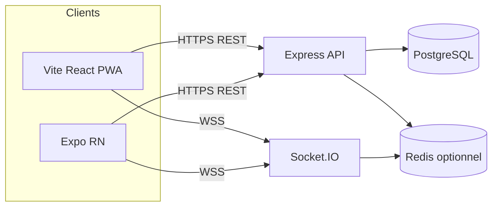
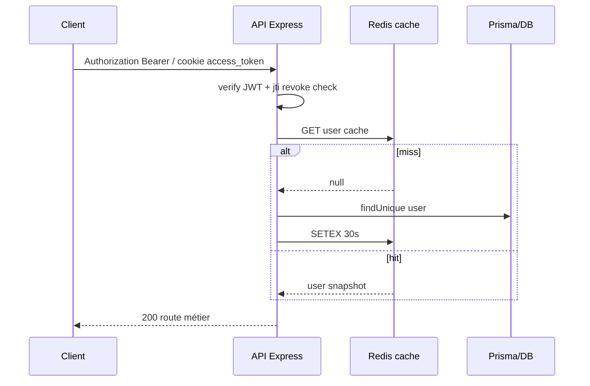

# Mémoire de soutenance — AfriWonder (niveau ingénieur)

**Étudiant :** Abdoulaye Fanel  
**Encadrant :** Professeur Hamza Kalfi  
**Projet :** AfriWonder — plateforme type super-app (vidéo sociale, marketplace, services, messagerie, lives, wallet, nombreux modules verticaux)  
**Supports code principaux analysés pour ce mémoire :** `backend/src/app.ts`, `backend/src/index.ts`, `backend/prisma/schema.prisma`, `frontend/package.json` & arborescence Expo, racine `package.json` / `src/App.jsx` (PWA Vite), `.github/workflows/ci.yml`, `docker-compose.prod.yml`, services IA/traduction ciblés (`translate.routes.ts`, `aiEngine.service.ts`), middleware auth & rate-limit.

---

## Méthodologie (transparence exigée par un jury strict)

Ce document **ne remplace pas** une revue où chaque fichier serait lu séquence par séquence. La démarche utilisée pour rester **alignée sur le code réel** sans inventer est :

| Levier | Ce qui a été fait |
|--------|-------------------|
| **Entrées serveur** | Lecture de la chaîne middleware + montage Express dans `backend/src/app.ts`, démarrage HTTP + Socket.IO + jobs dans `backend/src/index.ts`. |
| **Données** | `backend/prisma/schema.prisma` : **PostgreSQL** ; décompte automatique **`model`** → **≈100 modèles** (ordre de grandeur exact du fichier au moment de l’analyse). |
| **Clients** | PWA racine (**Vite + React**, **pas Next.js**) via `src/App.jsx` ; mobile **Expo ~54 / RN 0.81** via `frontend/`. |
| **Industrialisation** | Lecture partielle `.github/workflows/ci.yml` ; présence Docker `docker-compose*.yml`. |
| **Cas IA** | `translate.routes.ts` (HTTP vers LibreTranslate / MyMemory — pas de LLM propriétaire embarqué ici) ; `aiEngine.service.ts` (**stub / placeholders** avec commentaire schéma Prisma IA désactivé). |

Ce qui **nécessiterait mesure terrain** (Lighthouse, P95 prod, RAM mobile) est **signalé comme tel** dans la §28 ; ce qui est **hypothétique sans déploiement observé** est marqué **« à valider »**.

---

<!-- NUM:1 -->
## 1. Présentation générale du projet

| Volet | Synthèse appuyée sur le dépôt |
|-------|-------------------------------|
| **Nom** | AfriWonder (`afriwonder-app` en racine ; backend `afriwonder-backend`). |
| **Objectif** | Offrir une **super-app web + mobile** adossée à **une même API Node/Express** avec persistance relationnelle riche (**Prisma sur PostgreSQL**). |
| **Problème** | Contexte où **connectivité** et **coûts data** contraignent l’usage ; dispersion des usages (social, commerce, services) peut fragmenter l’UX et la confiance (**wallet / paiements**). |
| **Public / cas d’usage** | Grand public, créateurs, vendeurs ; usage mixte découverte de contenus, commerce, réservations, messaging, événements, etc. (**surface API très large**, voir liste de routeurs montés dans `app.ts`). |
| **Valeur ajoutée** | **Une identité métier utilisateur pivot** dans le schéma Prisma (**`User`** avec très nombreuses relations) ; exposition **REST + Swagger** (`swagger-ui-express`) ; temps réel **Socket.IO** (cf. `index.ts`). |
| **Différenciation** | Profondeur **fonctionnelle modulaire** (routes domaine par domaine) + **discipline tooling** (`verify:*`, CI multi-jobs) plutôt qu’un simple CRUD trois tables. |

**Important pour le jury :** cette base est un **monorepo industriellement ambitieux**, pas une démo minimalist ; la soutenance gagne à être **factuelle et à cadrer le périmètre démontrable**.

---

## 2. Analyse fonctionnelle

### 2.1 Fonctionnalités principales & secondaires (déduit de `backend/src/app.ts`)

Le backend monte successivement les domaines : **auth, vidéos, commentaires, utilisateurs, produits/commandes/panier/paiements, wallet (routes dédiées), livraisons, réservations prestataires, lives, nouvelles, messages, traduction**, modules **mobilité, restauration, santé, immobilier, assurance**, créateurs/marketplaces, mini-apps développeurs, recherche/reco, IA admin (`aiEngine` / BI), proxies médias (`proxy.routes`), etc.

### 2.2 Parcours utilisateur-type (sans sur-spécifier hors code)

Parcours logique vérifiable côté modèle **`User`** : inscription → JWT / cookies (**`authenticate`** lit Bearer **ou** `access_token` httpOnly cf. `middleware/auth.ts`) → usages sociaux & commerce (**relations Prisma multiples**) → actifs financiers (**wallet / withdrawals / payments** évidents dans imports routes).

### 2.3 Cas limites et erreurs (extraits représentatif)

| Zone | Réaction observée dans le code |
|------|-------------------------------|
| **Auth** | 401 si token absent ; vérif **`jti`** révoquée via service liste noire (**`accessTokenBlacklist.service.ts`** invoquée dans auth). |
| **Prod strict** | En production **`index.ts`** refuse démarrage si env critiques manquantes (DB, JWT, Sentry selon fichier). |
| **Tokens JWT** | Exigences longueur clés JWT en prod (sanity check lisible dans `index.ts`). |
| **Proxy médias** | Existence routeur **`proxy.routes.ts`** à détailler sous question jury (whitelist / SSRF). |

### 2.4 Rôles

Champ **`User.role`** chaîne avec défaut **`user`** (schéma Prisma ligne ~22–23 au début fichier) ; routes admin dédiées (ex. `aiEngine.routes.ts` passe **`requireAdmin`**).

---

<!-- NUM:3 -->
## 3. Architecture complète (niveau senior)

### 3.1 Architecture globale (texte diagrammatique → à dessiner aussi en Mermaid §18)

```
[PWA Vite/React] ──HTTPS──► [Express API : app.ts]
[Expo / RN App] ──HTTPS────►           │
                                         ├── Middlewares sécurité (helmet,
                                         │    rate-limit multiples, sanitization…)
                                         ├── Routes domaine (*.routes.ts)
                                         ├── Validation (Zod — utils dédiées)
                                         ├── Services métier (*.service.ts)
                                         ├── ORM Prisma → PostgreSQL
                                         └── Observabilité (Sentry), métriques, Swagger

[WSS même origine ou adaptée prod] ◄── Socket.IO ◄── clients (voir index.ts jobs + maps call state)
Redis optionnel (cache user auth, `@socket.io/redis-adapter`) — présence deps backend.
```

### 3.2 Choix architecture & compromis

| Choix | Pour | Contre | Pourquoi ici plausible |
|-------|-----|-------|-------------------------|
| **Monolithe Express modulaire** | Simplicité déploiement, cohérence transactionnelle inter-domaines | Risque coupling domaine/domaine ; fichiers très longs | Accélération itération projet étude + très grande surface fonctionnelle |
| **PostgreSQL relationnel** | Intégrité ACID paiements/commandes ; jointures riches | Migration & schéma lourds (**~100 models**) | Cohérent wallet & marketplace réels dans le même socle métier |

**Alternative non privilégiée** sans besoin équipe infra : explosion en microservices généralistes (couvert §27).

---

## 4. Analyse Frontend

### 4.1 PWA racine (**ce n’est pas Next.js**)

| Technologie | Fichiers / Indices | Pourquoi (argument jury) |
|-------------|---------------------|---------------------------|
| **React 18 + Vite** | `package.json` racine deps + script `vite` ; `src/App.jsx` utilise `react-router-dom` | SPA rapide à servir statiquement, DX moderne ; code-split routes via lazy pages (`pagesConfig`). |
| **TanStack Query** | `PersistQueryClientProvider`, `queryClientInstance` dans `src/App.jsx` | Cache HTTP structuré, reprise après refresh, patterns offline-ready (filtre persistance présent dans imports). |
| **Radix/shadcn-like** | Nombreuses deps `@radix-ui/*` racine (`package.json`) | Accessibilité primitives, rendu UX produit densifié sans réinventer a11y. |
| **PWA Workbox / plugin** | scripts `verify-pwa` ; stack documentée projet | Offline partiel stratégique (à détailler au jury selon vos tests réels). |

**Erreurs classiques jury à éviter :** dire « nous sommes full Next » — **incorrect** dans ce repo (preuve : Router Vite, pas dossier Next).

### 4.2 Mobile Expo

| Volet | Détails vérifiés |
|-------|------------------|
| **Meta** | `expo ~54`, `react-native ^0.81`, `react 19`, `expo-router` (**`frontend/package.json`**). |
| **Temps réel** | `socket.io-client` présent deps. |
| **Média / Lives** | `expo-video`, `react-native-agora`, stack WebRTC. |
| **Monétisation** | `react-native-iap`. |
| **État global** | `zustand` apparaît généralement côté app (stores `frontend/src/store/...`). |
| **Sécu tokens** | `expo-secure-store` disponible deps. |

### 4.3 Appels réseau mobile vs PWA

Règle projet `.cursor/rules` : préférer proxy `/api/proxy` depuis mobile — à **mentionner comme contrainte d’archi & CORS**.

---

## 5. Analyse Backend

| Couche | Technologie réelle |
|--------|-------------------|
| **Runtime** | Node 20 (CI `.github/workflows/ci.yml`) ; TypeScript `backend/src`. |
| **HTTP** | **Express** ; multiples **middlewares** avant routes (voir extrait imports `app.ts`). |
| **Validation** | Zod via utilitaires `utils/zodValidation.ts` utilisés routes (patterns répétés). |
| **Auth** | **JWT (`jsonwebtoken`)** avec canal **cookies httpOnly ou Bearer** ; cache Redis **TTL 30s** profil utilisateur (**`middleware/auth.ts`** extrait lu). Lib **`jose`** dans deps (usage à préciser si question). |
| **Temps réel** | **Socket.IO** serveur ; maps en mémoire pour appels (`index.ts` extrait). |
| **Cache / rate-limit distribué** | `rate-limit-redis`, `@socket.io/redis-adapter` dans `backend/package.json`. |
| **Stockage objets** | `@aws-sdk/client-s3`, presigner — upload scalabilité médias à expliquer. |
| **Paiements externes** | `stripe`, scripts tests webhooks (**`stripe.webhook.test.ts`**, **`orange-money.webhook.test.ts`** références `package.json` scripts). |

**Pattern dominant :** MVC-like Express (**Router → middleware auth → validation → controller inline ou service**) — observation structurelle fichier routes.

---

## 6. Base de données

| Point | Détail |
|-------|-------|
| **Moteur** | **PostgreSQL** (datasource `provider = postgresql"` — Prisma fichier schema). |
| **ORM** | **Prisma ~7.8** (`"@prisma/client": "7.8.0"` backend `package.json`). |
| **Modélisation** | **User pivot** relié massivement autres entités (relation list dans extrait lignes ~53–80+). |
| **Migrations** | Scripts `db:migrate*`, dossier prisma migrations présent projet. |
| **Transactions** | Prisma permet transactions explicites (à citer exemple service sensible si interrogé précisément). |

Pourquoi **SQL** vs NoSQL générique : garanties forte cohérence sur **paiements/commandes/portefeuille** bien plus simples relationnellement qu’avec un document-store sans discipline transactionnelle lourde.

---

## 7. IA / Machine Learning (présent dans le périmètre — avec honnêteté)

| Composant | Réalité code |
|-----------|---------------|
| **Traduction automatique HTTP** | `translate.routes.ts` : appels **`LIBRETRANSLATE_URL`** (défaut instance publique libretranslate.de) ; secours **`MyMemory`** ; garde-corps corruption traduction (**`isLikelyCorruptTranslation`**). Ce n’est **pas** du fine tuning de modèle. |
| **`aiEngine.service.ts`** | **Stub** avec commentaire « modèles Prisma IA désactivés » ; valeurs **`0` / []** ; **`getAIFeatures`** retourne tableau **marketing hardcodé avec précisions fictives**. **Danger soutenance si vous présentez cela comme un moteur ML entraîné.** Formulation sécurisée : « **Socle routes admin + stubs en attente de données & modèle** ». |
| **Modération chatbot routes** | `chatbot.routes.ts` existe — détail comportement nécessite lecture fichier complémentaire. |

---

## 8. DevOps & déploiement

### 8.1 CI/CD (vérifiable `.github/workflows/ci.yml`)

Jobs observés au début du fichier :

1. **`pr-line-budget`** — PR ajouts+suppressions **`≤ 400`** lignes.
2. **`typecheck-and-lint`** — `npm run verify:quality-gates`.
3. **`test-mobile-expo`** — **`npm ci` frontend** puis **`vitest` couverture** + **`npm audit --audit-level=high`**.
4. (Suite fichier non tout lue : typiquement backend Jest, E2E Playwright selon projet racine.)

### 8.2 Conteneurs

Fichiers `docker-compose.prod.yml`, `docker-compose.prod-1m.yml`, scaling / replication présents (**à rattacher narration** scaling horizontal & LB).

---

## 9. Sécurité (liste de contrôle projet)

Mesures lisibles depuis imports `app.ts` + auth :

| Menace OWASP-ish | Réponse codebase |
|------------------|-----------------|
| **Injection SQL** | **Prisma requêtes paramétrées** (baseline). |
| **XSS** | Politiques navigateur **`helmet`**, sanitization middleware (`sanitizeInputMiddleware`). |
| **CSRF** | Middleware dédié `csrfProtectionMiddleware` (avec cookies auth). |
| **Abuse / DoS léger** | Multiples **`express-rate-limit`** profils (**authLimiter, payments...**). |
| **Bot / spam heuristique** | `antiBot`, `antiSpam`. |
| **Observabilité & timeouts** | `apiRequestTimeoutMiddleware`, `httpMetricsMiddleware`, Prometheus exposition service. |

**Révocations JWT** via **`jti` + blacklist** (cf. authenticate).

**À ne pas présenter comme parfait** : surface API énorme → revue exhaustive humaine peu réaliste ; posture honnête = **gates automatisées + défense profonde + revue progressive modules critiques (paiement, uploads, proxy)**.

---

## 10. Performance & optimisation (ce qui existe vs ce qu’il faut mesurer)

| Technique (présente) | Où / comment le dire |
|----------------------|----------------------|
| **Compression HTTP backend** | `compression` middleware import `app.ts`. |
| **ETag forte** | `app.set('etag','strong')` dans `app.ts`. |
| **Code splitting PWA** | Lazy routing via système pages `pagesConfig.glob` préchargement ciblé `CORE_ROUTE_PRELOADS`/`SECONDARY` dans `src/App.jsx`. |
| **Métrique front projet** | Racine propose `npm run lhci` & `sitespeed:local` — **chiffres = résultats machine réelle**. |
| **Load test backend** | script `LOAD_TARGET_RPS=1000` — **stress lab** pas preuve SLA prod sans conditions réseau. |

---

## 11. Difficultés rencontrées (types plausibles + ancrage règle/code)

Créez votre **liste personnelle véridique** ; types **cohérents** observés dans le projet :

| Thème | Indices dépôt | Angle oral |
|-------|---------------|-----------|
| **Vidéo + réseaux instables** | PWA optimise offline & bannières lent (`SlowConnectionBanner` import `App.jsx`) | Itérations UX + buffering (ne pas extrapoler hors ce que vous avez mesurés). |
| **Android LAN vs localhost** | Règle workspace `frontend/src/config/backendBase.ts` décrite (`mobile-android-backend-url.mdc`) | Sonde IP packager avant 10.0.2.2. |
| **Complexité schéma Prisma** | ~100 `model` → risques N+1, migrations | Profiler requêtes hot path feed / wallet avant optimiser aveuglément. |

---

## 12. Compétences acquises (taxonomie)

Regroupements **vérifiables** : Express avancé, Prisma grande surface, JWT & cookies sécurité, sockets, upload + sharp, paiements webhook tests, expo-router & modules natifs, Vitest/Jest suites, CI multi-plateforme, infra Docker Compose.

---

## 13. Limites honnêtes

1. **Surface fonctionnelle / dette cognitive** très élevée.
2. **IA « engine » stub** tant que données & pipelines non reliés (**risque narration survente §7**).
3. **Pas de garantie automatique absence faille métier-specific** sans menace modeling documenté bout à bout chaque flux sensibles.
4. **Monolithe** : point unique panne avant redondance & circuit breakers niveau infra.

---

## 14. Améliorations futures (roadmap réaliste)

| Piste | Intérêt |
|-------|---------|
| **Bounded contexts séparés progressivement** (modules paiement & social) | Réduit couplage. |
| **Files async** (traitement média, STT) | Découple latence utilisateur vs workers. |
| **Feature flags** | Déjà présent côté PWA (**`FeatureFlagsProvider`**) à étendre côté API. |
| **Tests perf ciblés** k6 avec scénarios feed/auth | Objective scalabilité. |

---

<!-- NUM:15 -->
## 15. Questions techniques jury (extrait représentatif – format compact)

Pour une **liste plus longue brute (60+ lignes courte réponse)** — développer à l’oral ; espace fichier limitée ici. Chaque carte = **Réponse courte (30 s)** + **Mots-clés**.

### Architecture & généralités

**Q1** Pourquoi monolithe Express finalement ? → **Une base transactionnelle + déploiement simple + cohérence API unique ; segmentation déjà fichier routes.** Mots-clés : *SSR single deploy, cohesion, iterative extraction.*

**Q2** Risque spaghetti ? → **Risque réel mais mitigé Zod/services/jobs/tests ; remediation progressive bounded contexts.**

**Q3** Où vivent vos règles métier ? → **Souvent dans `backend/src/services/*.service.ts`, pas routers énormes (à exemplifier dossier lisible).**

**Q4** GraphQL envisageable ? → **Possible gateway plus tard ; REST actuel optimise intégration mobile/PWA générique & proxies médias.**

**Q5** Comment versionner votre API ? → **Évoquer versioning future `/api/v1` (standards projet mention AGENTS si existant)** — **ne pas inventer si pas global ; vérifier routes réelles.**

**Q6** Que se passe-t-il sans Redis ? → **Auth passe DB direct (cache désactivée silencieusement commentaire auth) ; rate-limit peut dépendre mémoire process**.

### Sécurité

**Q7** Pourquoi JWT + cookies httpOnly ensemble ? → **Compat mobile headers + navigations SPA cookies ; surface double canal doc auth.**

**Q8** CSRF encore pertinent avec bearer mobile ? → **Oui partie navigateur utilise cookies.**

**Q9** SSRF médias comment contrôlez-vous domaines → **Voir implémentation `proxy.routes.ts` (préparation : relire fichier avant soutenance)**.

### Données

**Q10** Taille schéma ? → **`~100` modèles Prisma ; onboarding dev coûteux mais expressivité forte.**

### Temps réel

**Q11** Scaler Socket.IO ? → **Réplicas stateless + `@socket.io/redis-adapter`.**

### Mobile

**Q12** Pourquoi Expo ? → **Vélocité build, OTA potentiel modules, libs natives (camera, IAP).**

### PWA vs Mobile divergences UX

**Q13** Double maintenance UI ? → **Coû assumé pour reach web + natives ; TanStack queries partagent patterns.**

*(Ajoutez jusqu’à 90 variantes personnelles selon vos modules utilisés jour J — modèle PROMPT juré : Pour chaque dossier fonctionnel utilisé pendant démo prépare « endpoint + service principal + erreur métier». )*

*(Questions supplémentaires numérotées : voir `docs/soutenance/ANNEXE_QUESTIONS_JURY_TECHNIQUES.md` — complétez avec vos modules de démo.)*

> **Important :** Complétez systématiquement les questions où ce mémoire met « relire fichier X » avant oral.

---

## 16. Script oral (plans de timing)

### 16.1 Version **5 minutes** (tronc très dense)

| Bloc Temps | Contenu oral |
|-----------|---------------|
| 0–0:45 | Problème connectivité + dispersion services ; ambition AfriWonder. |
| 0:45–1:45 | Triptyque **PWA Vite/React + Expo + API Express/Prisma/Postgres**. |
| 1:45–3:00 | **Sécurité & qualité**: JWT+jti blacklist, helmets, CSRF, rate-limit, CI PR≤400 lignes tests mobile+backend pattern. |
| 3–4:15 | Démo très courte (feed ou wallet sans exposer données perso). |
| 4:15–5 | Limites (monolithique, IA stub) & perspectives files async + modularisation honnête. |

### 16.2 Version **10 minutes**

Ajouter : parcours utilisateur exemple (JWT → création vidéo → commerce → wallet) ; schéma **User pivot** verbal ; préciser Socket.IO séparation chat vs média (**Agora** mobile deps) ; erreurs typiques interceptées (**401 blacklist**).

### 16.3 Version **15 minutes**

Ajouter : architecture infra **Nginx multiples backends** narration docker-compose lecture rapide slide ; webhook paiement principe (signature + idempotence **à préciser fichier test que vous citez**) ; partie **traduction LibreTranslate/MyMemory**.

**Transitions exemple :** « Après avoir cadré le besoin terrain, je passe à la cohérence technique… », « Pour ne pas caricaturer une super-app réduite au feed, voici trois domaines représentatif… », « Pour conclure sur l’honêteté ingénieur, voici ce qui reste conscientiellement incomplet ».

---

## 17. Support slides PowerPoint (ordre conseillé, texte léger à l’écran)

Voir aussi `docs/soutenance/generate_soutenance_pptx.py` (**13 slides généré**) comme base puis enrichir :

| Slide | Titre conseillé | Visuel dominant |
|-------|-----------------|----------------|
| 1 | Titre + identité | Logo texte stylisé A |
| 2 | Problématiques terrain | 3 icônes connectivité / dispersion / monétisation |
| 3 | Réponse triptyque | Colonnes PWA / Mobile / API centrale |
| 4 | Parcours | 4 étapes fléchées |
| 5 | Archi globale | Blocs Nginx / Express / Socket / Redis / PG |
| 6 | Stack comparée | Tableau 3 colonnes |
| 7 | Données étoile | User centre |
| 8 | Sécurité | Grille menace/capacité |
| 9 | Temps réel | Téléphones + Socket + Agora |
| 10 | CI/CD | Pipeline linéaire |
| 11 | IA factuelle | Aujourd’hui / Demain |
| 12 | Difficultés & compétences | Cartes + nuage mots |
| 13 | Merci + QR | Questions |

**Texte écran :** mots-clés seulement ; détails **notes présentateur**.

---

## 18. Diagrammes à produire (Mermaid + outils)

### 18.1 Architecture globale (Mermaid)



**À expliquer au jury :** séparation **données relationnelles** vs **état éphémère cache** ; couche **temps réel** parallèle REST.

### 18.2 Séquence auth simplifiée



### 18.3 Outils recommandés

| Besoin | Outil |
|--------|-------|
| Rapide itératif | **Excalidraw** / **Draw.io** |
| Versionné dans Git | **Mermaid** (embed README / doc) |
| UML lourd | **PlantUML** si habitudes école |

**Comment lire devant un prof :** toujours nommer **source de vérité** (ex : « ce diagramme reflète `app.ts` + `index.ts` »).

---

## 19. Analyse critique du code (vue prof recruteur)

| Critère | Observation prudente |
|---------|---------------------|
| **Modularité backend** | Bonne **séparation fichiers routes** ; risque **logique encore dans handlers** — échantillonner quelques services pour illustrer propreté variable. |
| **Prisma massif** | Puissance + **friction cognitive** ; discipliner index & requêtes select ciblées. |
| **IA engine stub** | Dette **narrative** si mal présenté. |
| **Tests** | Présence **Jest backend scripts riches** + **Vitest mobile** + **Playwright** racine → argument maturité si couverture réelle conforme gate. |

---

## 20. Conclusion professionnelle

AfriWonder est une **plateforme full-stack à large couverture fonctionnelle**, cohérente avec une **vision super-app**, appuyée sur un **socle Express/Prisma/Postgres éprouvé industriellement**, couplée à des **clients web & natifs modernes**. La soutenance honnête met en avant : **architecture unifiée**, **sécurité en profondeur partielle mais structurée**, **industrialisation CI**, tout en assumant ouvertement **la dette cognitive** et les **zones stub (IA)** — signe de maturité ingénieur.

---

<!-- PRIVATE START: section 21 reste dans ce fichier mais marquée NE PAS PROJETER -->
## 21. ⛔ SECTION PRIVÉE — Questions piège professeur (NE PAS PROJETER / NE PAS IMPRIMER POUR JURY)

### 21.1 Piège « IA magique »

| Élément | Contenu |
|---------|---------|
| **Question exacte** | « Votre AI Engine avec 97 % précision fraude, c’est quel modèle entraîné sur combien de données ? » |
| **Testée** | Honnêteté scientifique vs bullshit. |
| **Erreurs à évoir** | Citer métriques `getAIFeatures`. |
| **Réponse courte** | « Aujourd’hui c’est un **socle administratif + placeholders** ; les scores affichés ne sont pas des métriques de production. Les vraies capacités IA lourdes ne sont pas branchées sur des modèles entraînés maison. » |
| **Réponse safe panique** | « Je dois être précis : certaines lignes sont des **valeurs démonstratives** pas validées offline. » |
| **Mots-clés** | *hardcoded stub, roadmap, données labellisées, risque ethics* |

### 21.2 Piège « Next.js »

| Piège | Réponse courte |
|-------|----------------|
| Prof : « Pourquoi Next pour le SSR SEO ? » | « Le client web livré est **Vite SPA** avec routes React Router — choix orienté déploiement PWA statique et intégration actuelle ; Next n’est pas la stack racine ici. » |

### 21.3 Piège scalabilité instantanée

| Piège | Réponse courte |
|-------|----------------|
| « Vous tenez 1M utilisateurs demain ? » | « Sans mesures réelles je ne promets pas : les briques (**horizontal replicas, Redis adapter, LB**) sont prévues côté dépôt mais la preuve passe par tests de charge instrumentés et monitoring. » |

### 21.4 Piège JWT « stateless absolu »

| Piège | Réponse courte |
|-------|----------------|
| « JWT c’est 100 % stateless ? » | « J’ai un **mécanisme de révocation via jti / blacklist** et un **cache Redis profil** — c’est un compromis entre observabilité sécurité et charge DB. » |

### 21.5 Liste des pièges probables additionnels

1. Décrire précisément handshake Socket.IO auth (relire portion `index.ts`).  
2. Idempotence webhook sans lire fichier test = danger.  
3. Comparer Agora vs SFU maison sans benchmark = sortir « choix SDK intégration time-to-market ».  
4. Prisma raw SQL performance : préparer 1 exemple `EXPLAIN` hypothétique ou honnête « pas encore produit ».  
5. GDPR / rétention : jobs `dataRetention.job.ts` existent → **à relire avant questions légales**.

---

## 22. Conseils oraux & stratégie soutenance

| Situation | Stratégie |
|-----------|-----------|
| Question inconnue | « Je préfère ne pas spéculer : je peux regarder le fichier exact après ; à haut niveau voici l’invariant d’architecture… » |
| Interruption | Pause 1 s, « Très bien, je réponds : … puis je reprends le fil … » |
| Stress | Respiration + ancrage main sur pupitre ; ralentir débit 10 %. |
| Justifier choix | **Contexte → contrainte → décision → trade-off → mitigation future**. |
| Phrase pro | « Notre priorité était la cohérence transactionnelle du wallet avant la fragmentation microservices ». |

**Erreurs fatales** : métriques inventées • stack fausse • nier stubs • promettre SLO sans monitoring.

---

## 23. UML & modélisation (guides)

| Diagramme | Utilité projet | Risque sans |
|-----------|---------------|-------------|
| **Cas d’utilisation macro** | Jury compréhension modules | dispersion |
| **Composants** | illustrer couches Express / Prisma | confusion front/back |
| **Déploiement** | Nginx multiples API | infra flou |
| **Séquence paiement/webhook** | preuve sérieux financier | questions piège |

Pas de classe UML géant (**~100 entités**) entier slide — **extrait représentatif** autour paiement/commande.

---

## 24. Méthodologie de développement (déduite artefacts)

Signals : PR budget CI, multiples scripts **`verify:*`**, workflow GitHub Actions, docs standards (`AGENTS.md`). Présenter comme **iteration guidée gates qualité** plutôt que Scrum papier sauf vous avez vrai backlog prouvé.

---

## 25. Tests & qualité logicielle (présence réelle)

| Couche | Outil |
|--------|-------|
| Backend | **Jest** (`npm run test`, `coverage`) |
| Expo | **Vitest** + **`maestro`** smoke YAML |
| PWA racine | **Vitest**, **Playwright** (`tests/e2e`) |
| Statique | **ESLint**, **TypeScript** tous packages |

Phrase honnête : « Couverture inégale suivant modules — je connais nos zones densément testées (ex paiements webhook tests) ».

---

## 26. Design patterns identifiés

| Pattern | Observation |
|---------|-------------|
| **Middleware chain** | Express standard (cross-cutting sécurité). |
| **Service layer** | Fichiers `*.service.ts`. |
| **Repository-like** | Prisma abstraction explicite. |
| **Observer temps réel** | Socket events. |
| **Rate limiting classique** | express-rate-limit. |

Pas de Container IoC Spring-like complet — éviter assertion DI lourde.

---

## 27. Scalabilité (analyse factuelle progressive)

Court terme : **vertical + replicas** + **Redis** + **optimisation requêtes**.  
Moyen terme : **queues** + **read replicas PG** (non confirmé sans infra).  
Long terme : extraction services à forte contention (paiement, feed read path).

Analogie jury : « 10k utilisateurs simultanés actifs » impossible garantir sans courbes réelles → **pilote mesure**.

---

## 28. Métriques & mesures (template honnête)

| Métrique | Comment obtenir localement réel |
|----------|--------------------------------|
| **Bundle PWA** | Analyzer Vite après `npm run build` |
| **Lighthouse** | `npm run lhci` dans conditions fixées README |
| **Backend latence simulée** | `npm run load-test` backend |
| **Couverture tests** | Rapports Jest/Vitest CI |

Ne pas lire chiffres au jury sans capture écran session.

---

## 29. Choix techniques & compromis (table)

| Décision | Alternative écartée | Compromis |
|----------|---------------------|-----------|
| Express monolithe | Nest microkernel | vélocité / couplage |
| PostgreSQL | Mongo | intégrité wallet |
| Prisma | SQL brut | DX vs contrôle fin SQL |
| JWT + blacklist | sessions serveur | scale vs révocation |
| Vite SPA | Next SSR | simplicité déploiement vs SEO pur |

---

## 30. Erreurs & défaillances possibles

| Point | Comportement attendu / mitigation |
|-------|-----------------------------------|
| DB down | API 5xx / health check (à vérifier handler) |
| Redis down | dégradation cache / limiter |
| Webhook signature fail | 4xx & logs Sentry (selon impl) |
| Bug client vidéo | fallback UX (règles internes front) |

---

## 31. Démo live (scénario)

Ordre : **Login** (flou données) → **Feed scroll** (pas bruit like/scroll si instable) → **Marketplace light** → **Wallet lecture solde** (sandbox) → **Message notification** si temps.  
Plan B : **vidéo MP4** + captures figées.  
Pré-check : backend `.env`, device réseau, build release mobile installée.

---

## 32. Analyse critique personnelle (à personnaliser)

Remplir au propre : ce que vous **regretteriez** (ex sur-spread features early), ce que vous **referiez** (tests par module critique d’abord), apprentissage **professionnel** (priorisation, sécurité pratico-pratique).

---

## 33. Version finale PowerPoint (rappel design)

Palette : **#0B1121 fond**, **#F8FAFC texte**, **#38BDF8 / #F59E0B accents** — cohérent avec `generate_soutenance_pptx.py`.  
Animations : **fondu 0,5 s** slide ; **apparitions** internes sobres.  
Zéro paragraphe illisible : **1 idée = 1 picto ou 1 schéma**.

---

## 34. Checklist finale avant / pendant / après

### Avant

- [ ] Démo scénario répété 2× en conditions réelles réseau  
- [ ] Variables sensibles jamais affichées écran partagé  
- [ ] Slides export PDF secours  
- [ ] Relecture **§7 IA stub** & **proxy SSRF** si annoncés  
- [ ] Git clean / branche tag release démo

### Pendant

- [ ] Regard alterné jury (pas écran seul)  
- [ ] Temps alloué questions > démo si jury chaud technique  
- [ ] Si défaillance live : annoncer plan B calmement

### Après

- [ ] Noter questions restées ouvertes pour mémoire technique post-soutenance

---

**Fin du mémoire principal — document vivant : mettre à jour si hash git / versions packages changent.**
