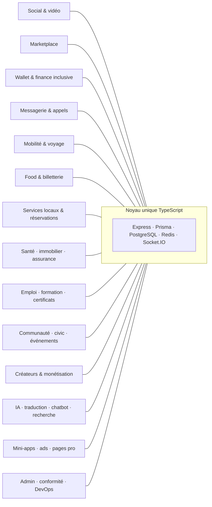

# AfriWonder — illustration système complète

> Vue d’ensemble du projet : **toutes les grandes familles de services** (le marketplace est **un module** parmi beaucoup d’autres, au même niveau que transport, santé, wallet, etc.).
> Copier les blocs `mermaid` dans [mermaid.live](https://mermaid.live) pour exporter PNG/SVG vers PowerPoint.

---

## 1. Carte macro — une seule « grande » illustration

À utiliser comme **slide récapitulative** : clients → noyau → domaines métier → données & externe.

```mermaid
flowchart TB
  subgraph ACT["Acteurs"]
    A1["Citoyens · créateurs · acheteurs · vendeurs · chauffeurs · prestataires · stars · admins"]
  end

  subgraph CLI["Clients logiciels"]
    W["PWA — React 18 · Vite"]
    M["Mobile — Expo SDK 54+ · React Native"]
  end

  subgraph CORE["Noyau plateforme AfriWonder"]
    API["API REST — Express · Node.js · TypeScript"]
    RT["Temps réel — Socket.IO"]
    SEC["JWT · Zod · rate limit · Helmet"]
  end

  subgraph DATA["Persistance"]
    PG[("PostgreSQL — Prisma")]
    RD[("Redis")]
  end

  subgraph EXT["Externes"]
    PAY["Paiements Stripe / mobile money · webhooks"]
    TR["Traduction · IA · chatbot"]
    OBS["Sentry · métriques"]
  end

  S1["① Social / contenu — vidéos · feed · live · stories · posts · playlists · musique · news · modération"]
  S2["② Commerce — marketplace · panier · commandes · vendeurs · livraisons · litiges"]
  S3["③ Finance — wallet · pièces · commissions · paiements · microcrédit · tontines · épargne · cartes · factures · airtime"]
  S4["④ Communication — messagerie · appels · groupe · E2EE · stars payants"]
  S5["⑤ Mobilité / voyage — VTC · chauffeurs · covoiturage · bus · hôtels · lieux"]
  S6["⑥ Food / billetterie — restaurants · livraison · tickets événements"]
  S7["⑦ Services locaux — prestataires · réservations · services publics"]
  S8["⑧ Santé — médecins · RDV · pharmacies si module activé"]
  S9["⑨ Habitat — immobilier · assurance"]
  S10["⑩ Emploi / éducation — offres · cours · certificats"]
  S11["⑪ Communauté / société — communautés · événements · défis · civic · crowdfunding · parrainage"]
  S12["⑫ Créateurs — dashboard · deals · monétisation · gamification · classements"]
  S13["⑬ Transversal — recherche · matching · filtres · cloud · analytics · support · légal"]
  S14["⑭ Écosystème — mini-apps · publicité · pages pro · admin · BI · IA admin · DevOps"]

  ACT --> CLI
  CLI --> API
  API --> RT
  API --> SEC
  API --> PG
  API --> RD
  API --> PAY
  API --> TR
  API --> OBS

  API --> S1
  API --> S2
  API --> S3
  API --> S4
  API --> S5
  API --> S6
  API --> S7
  API --> S8
  API --> S9
  API --> S10
  API --> S11
  API --> S12
  API --> S13
  API --> S14
```

---

## 2. Vue équilibrée « hub » — chaque domaine au même plan (pas de priorité marketplace)

Utile si la slide 1 est trop dense : schéma **étoile** conceptuelle.

---

## 3. Phrase pour l’oral (équilibre marketplace vs reste)

> « AfriWonder n’est pas un simple marketplace : c’est une **super-app** qui réunit **social vidéo**, **commerce**, **finance et wallet**, **messagerie et appels**, **transport et food**, **santé**, **emploi et formation**, **communautés et civic**, **IA et mini-apps**, avec un **même backend** et les clients **PWA + Expo**. »

---

## Fichiers source dans le dépôt

- Montage des routes : `backend/src/app.ts`
- Routers par domaine : `backend/src/routes/*.routes.ts`
